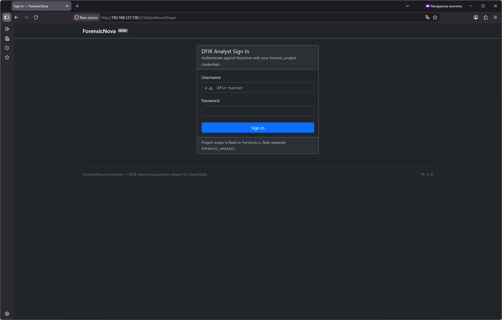
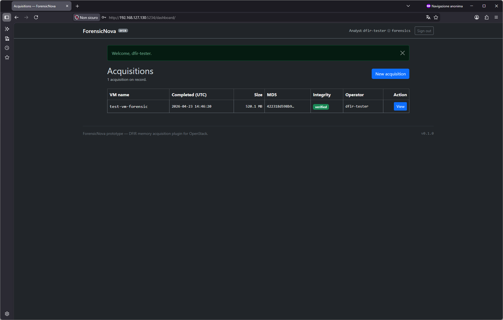
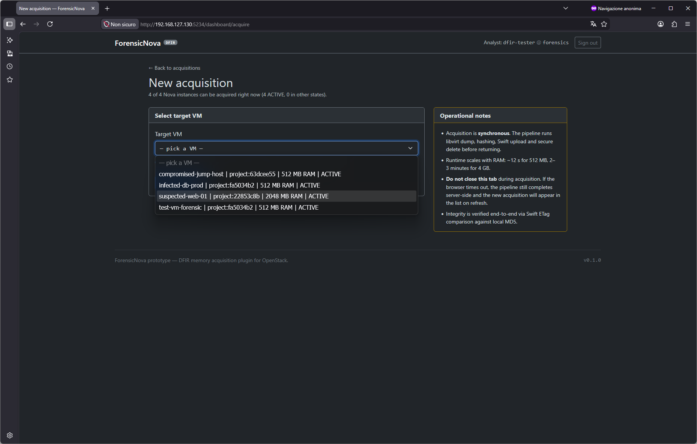
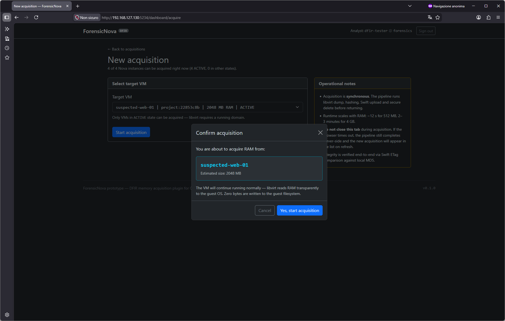
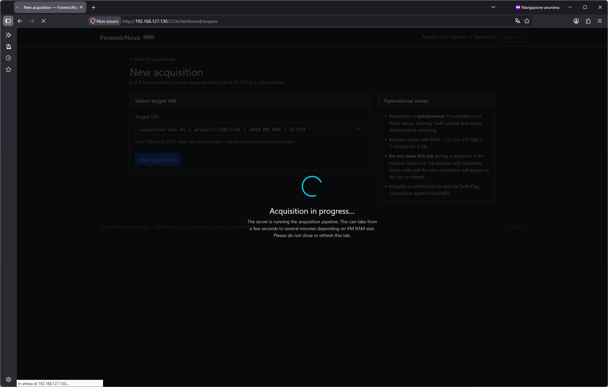
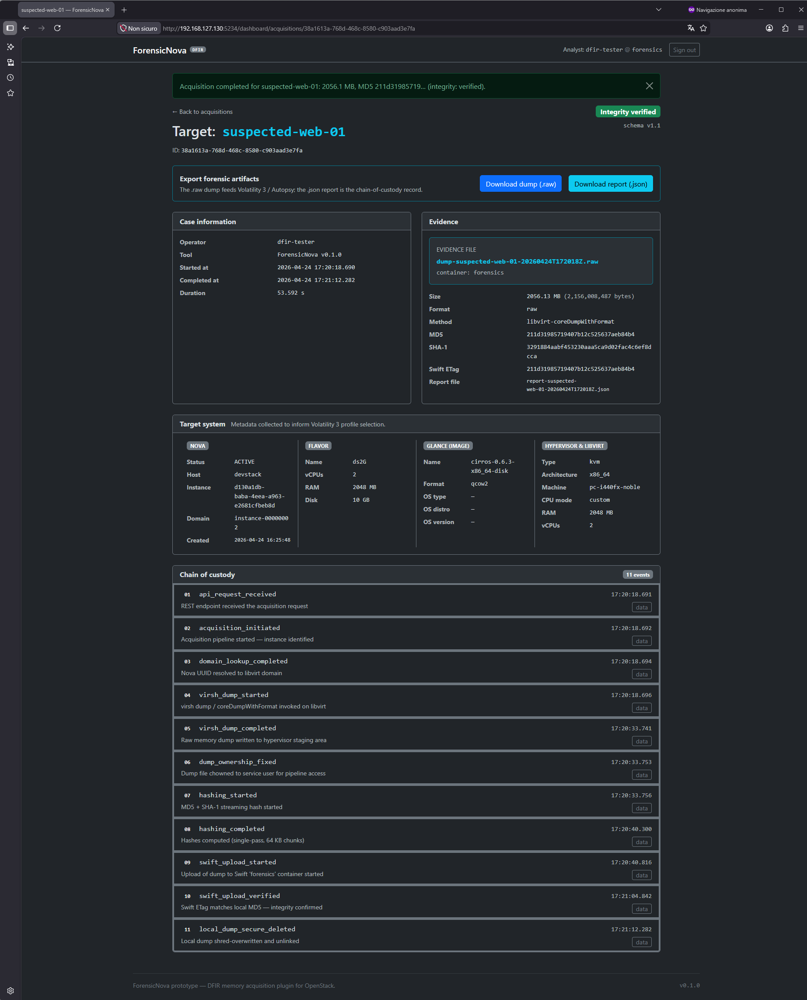
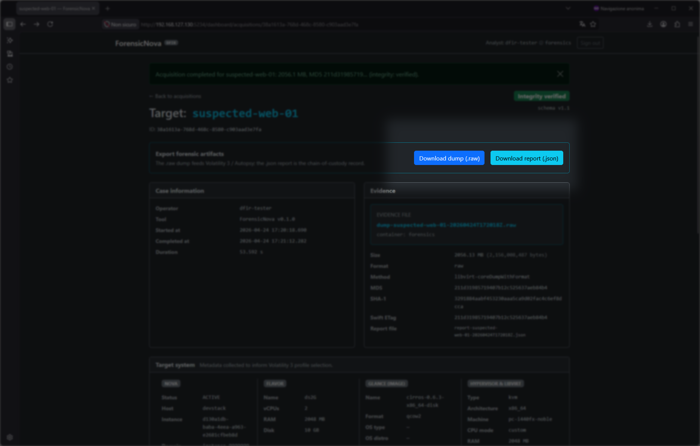
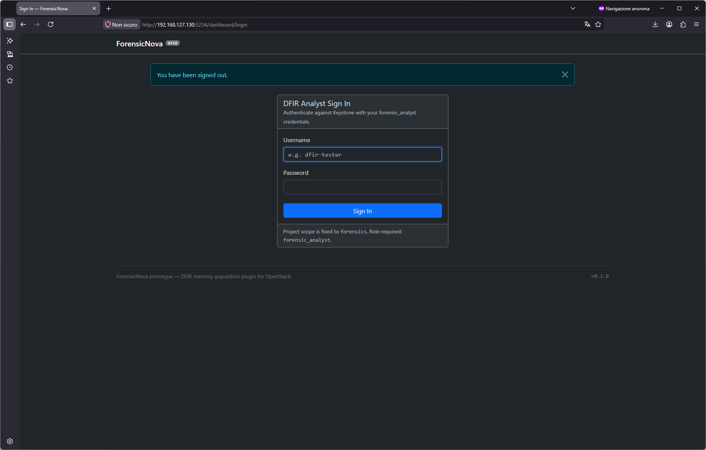

# ForensicNova

**DFIR memory acquisition plugin for OpenStack — forensically sound RAM dumps, cryptographic chain of custody, Swift-backed evidence locker.**

ForensicNova is a DevStack plugin that extends OpenStack with a dedicated digital-forensics service for incident response on tenant virtual machines. It acquires guest RAM at the hypervisor layer, computes integrity hashes in streaming fashion, stores the evidence in Swift with end-to-end etag verification, securely wipes the staging copy, and maintains an append-only chain-of-custody log — all fronted by a Flask REST API and an operator dashboard, gated by a dedicated Keystone role.

---

## Table of contents

- [Forensic soundness](#forensic-soundness)
- [Architecture](#architecture)
- [Quick start](#quick-start)
- [Dashboard walkthrough](#dashboard-walkthrough)
- [REST API](#rest-api)
- [Forensic evidence on disk](#forensic-evidence-on-disk)
- [Known limitations](#known-limitations)
- [Thesis roadmap](#thesis-roadmap)
- [Academic context](#academic-context)
- [License and author](#license-and-author)

---

## Forensic soundness

The acquisition pipeline is designed so that the resulting RAM dump is defensible in a judicial context. Six guarantees are implemented and traceable in the chain-of-custody log:

| # | Guarantee | Implementation |
|---|---|---|
| 1 | **Zero bits written inside the guest** | Acquisition happens via libvirt `coreDumpWithFormat()` reading `/proc/<qemu-pid>/mem` on the hypervisor. The guest OS is never touched, paged, or signaled. |
| 2 | **Dedicated forensic staging directory** | Temporary dump lands in `/var/lib/forensicnova/acquisitions/<uuid>/` with mode 600, owner `stack:stack`. Never in `/tmp`, never on the guest filesystem. |
| 3 | **Hashes computed on the hypervisor, before any transfer** | MD5 + SHA-1 computed in streaming (64 KB chunks, O(1) RAM) directly from the staging file. |
| 4 | **End-to-end etag integrity check with Swift** | On `PUT`, Swift returns an MD5 computed server-side. The plugin compares it against the hypervisor-local MD5. Mismatch → aborted pipeline, chain-of-custody flags `etag_verified: false`. |
| 5 | **Secure delete of the staging copy** | After a successful etag verification, the local dump is destroyed via `shred -u -n 1`. No recoverable residue on the hypervisor disk. |
| 6 | **Append-only chain of custody** | All pipeline events are written to `/var/log/forensicnova/chain-of-custody.jsonl` as JSON lines. The file is the authoritative audit log, immutable by design. |

These guarantees address the forensic chain from the moment RAM is read off the guest, through transfer and persistence in Swift, to every operator interaction thereafter.

---

## Architecture

```
 ┌──────────────────────────────────────────────────────────────────────────┐
 │                         OPERATOR / INCIDENT RESPONDER                    │
 │                                                                          │
 │    Browser ──┐                         curl / scripts ──┐                │
 │              │                                          │                │
 └──────────────┼──────────────────────────────────────────┼────────────────┘
                │ HTTPS/HTTP                               │ HTTPS/HTTP
                ▼                                          ▼
  ┌────────────────────────────┐      ┌────────────────────────────────────┐
  │ ForensicNova Dashboard     │      │ ForensicNova REST API              │
  │   Flask blueprint          │      │   Flask blueprint                  │
  │   session-based auth       │      │   Keystone token-based auth        │
  │   :5234/dashboard/         │      │   :5234/api/v1/                    │
  └──────────┬─────────────────┘      └──────────┬─────────────────────────┘
             │                                   │
             │         ┌─────────────────────────┘
             │         │
             │         ▼                 authN / authZ
             │  ┌───────────────┐       ┌─────────────┐
             └─►│ keystoneauth  │◄─────►│   Keystone  │  ← role: forensic_analyst
                └──────┬────────┘       └─────────────┘
                       │
                       │ acquisition pipeline
                       ▼
  ┌─────────────────────────────────────────────────────────────────────┐
  │                          HYPERVISOR (compute node)                  │
  │                                                                     │
  │   libvirt ──► coreDumpWithFormat() ──► /var/lib/forensicnova/...    │
  │                    │                              │                 │
  │                    │ metadata                     │ MD5 + SHA-1     │
  │                    ▼                              ▼ streaming       │
  │              ┌──────────┐                   ┌──────────┐            │
  │              │  Nova    │                   │  hasher  │            │
  │              │  Glance  │                   └────┬─────┘            │
  │              │  libvirt │                        │                  │
  │              │   XML    │                        │                  │
  │              └────┬─────┘                        │                  │
  │                   │                              │                  │
  │                   └──────────────┬───────────────┘                  │
  │                                  │                                  │
  │                                  ▼                                  │
  │                          ┌───────────────┐                          │
  │                          │  JSON report  │                          │
  │                          │  schema v1.1  │                          │
  │                          └───────┬───────┘                          │
  │                                  │                                  │
  └──────────────────────────────────┼──────────────────────────────────┘
                                     │   PUT + etag verification
                                     ▼
                          ┌─────────────────────┐
                          │    Swift container  │  ← evidence locker
                          │     "forensics"     │
                          │   dump-*.raw        │
                          │   report-*.json     │
                          └─────────────────────┘
```

**Pipeline stages** (sequential, all logged to chain of custody):

1. `acquire_memory` — libvirt `coreDumpWithFormat()` writes raw memory to the staging directory
2. `compute_hashes` — MD5 and SHA-1 computed in streaming
3. `collect_metadata` — Nova + Glance + libvirt XML consolidated in `target_system` block
4. `upload_dump` — Swift `PUT`, response etag compared to local MD5
5. `secure_delete` — `shred -u -n 1` on the staging file (only if etag verified)
6. `upload_report` — JSON report (schema v1.1) published to Swift next to the dump
7. `emit_coc_event` — final chain-of-custody entry sealing the acquisition

---

## Quick start

### Prerequisites

- Ubuntu 24.04 LTS host with hardware virtualization (KVM)
- DevStack `master` branch, tested against `2026.2`
- Python 3.12
- `stack` user with NOPASSWD sudo, membership in `libvirt` and `kvm` groups

### `local.conf` snippet

Add the following to your DevStack `local.conf`:

```ini
[[local|localrc]]
ADMIN_PASSWORD=secret
DATABASE_PASSWORD=$ADMIN_PASSWORD
RABBIT_PASSWORD=$ADMIN_PASSWORD
SERVICE_PASSWORD=$ADMIN_PASSWORD

HOST_IP=<your-host-ip>
SERVICE_HOST=<your-host-ip>

disable_service cinder c-api c-sch c-vol
enable_service s-proxy s-object s-container s-account
SWIFT_HASH=forensicnova_dev_hash
SWIFT_REPLICAS=1

LIBVIRT_TYPE=kvm

# ForensicNova plugin
FORENSICNOVA_DFIR_PASSWORD=<your-dfir-password>
enable_plugin forensicnova https://github.com/numdav/forensicnova main
```

Replace `<your-dfir-password>` with the password you want to assign to the `dfir-tester` user. Replace `<your-host-ip>` with the IP address of your DevStack host.

### Stack and validate

```bash
cd /opt/stack/devstack
./stack.sh
```

Once the stack completes, verify the plugin is running:

```bash
# Systemd unit active
systemctl is-active devstack@forensicnova
# Expected: active

# Health endpoint reachable
curl http://<HOST_IP>:5234/health
# Expected: {"status":"ok","service":"forensicnova","version":"..."}
```

### Access the dashboard

Open `http://<HOST_IP>:5234/dashboard/` in a browser and log in with:

- **Username**: `dfir-tester`
- **Password**: the one set via `FORENSICNOVA_DFIR_PASSWORD`
- **Project**: `forensics`

---

## Dashboard walkthrough

The operator dashboard is a session-authenticated Flask blueprint that wraps the REST API. It requires a Keystone user holding the `forensic_analyst` role.

### 1. Login



Credentials are validated against Keystone directly (OAuth-style token request). A successful login requires the `forensic_analyst` role on the target project; otherwise the login is rejected with a clear error message.

### 2. Acquisitions list



The landing page after login. Each row shows the VM name, acquisition timestamp, dump size, MD5 prefix, and quick links to the detail view. The list is populated by scanning the `forensics` Swift container and parsing the JSON reports.

### 3. New acquisition form



The "Acquire" action opens a form with a dropdown of all VMs visible to the `dfir-tester` user — across every Keystone project. This cross-tenant visibility is the practical embodiment of the `forensic_analyst` role: an incident responder does not pre-know which project holds the compromised VM.

### 4. Confirmation modal



Acquiring RAM is a privileged, long-running operation. A Bootstrap modal asks for explicit confirmation before the pipeline starts. The selected VM's name is echoed in the modal to prevent misclicks.

### 5. Acquisition in progress



During the synchronous acquisition, the UI shows a spinner overlay. For a 2 GB guest, the full pipeline (libvirt dump, hashing, Swift upload with etag verify, secure delete, report publish) completes in roughly 5 to 10 seconds on a KVM-nested lab setup.

### 6. Acquisition detail



The detail view renders the full JSON report in a human-readable layout: timestamps, instance metadata, `target_system` (which helps Volatility 3 auto-select the correct profile), dump metadata including both hashes and the verified Swift etag, and the chain-of-custody timeline with all pipeline events in order.

### 7. Download actions



From the detail page the operator can download the raw dump (`.raw`) and the JSON report (`.json`) directly. Downloads are streamed from Swift through the API with constant memory usage on the ForensicNova service, so multi-gigabyte dumps do not blow up the WSGI process.

### 8. Logout



Session teardown removes the cached Keystone token and shows a confirmation flash on the login page. The session cookie is also invalidated server-side.

---

## REST API

All endpoints listen on port `5234`. Every route under `/api/v1/` is authenticated via Keystone token (`X-Auth-Token` header) and requires the `forensic_analyst` role on the scoped project.

| Method | Path | Auth | Description |
|---|---|---|---|
| `GET` | `/health` | none | Service liveness probe. |
| `POST` | `/api/v1/servers/<id>/memory_acquire` | token | Synchronously acquires RAM from the Nova instance `<id>` and returns the full JSON report. |
| `GET` | `/api/v1/servers/` | token | Lists all Nova instances visible to the authenticated user (cross-tenant for `forensic_analyst`). |
| `GET` | `/api/v1/acquisitions/` | token | Lists all acquisitions in the Swift evidence container with summary metadata. |
| `GET` | `/api/v1/acquisitions/<id>` | token | Returns the full JSON report for acquisition `<id>`. |
| `GET` | `/api/v1/acquisitions/<id>/dump` | token | Streams the raw dump file (`.raw`) as an HTTP attachment. |
| `GET` | `/api/v1/acquisitions/<id>/report` | token | Returns the JSON report as a downloadable attachment. |

### Example: trigger an acquisition

```bash
# Obtain a Keystone token scoped to the forensics project
TOKEN=$(openstack token issue -f value -c id)

# Acquire RAM from a Nova instance
curl -sX POST \
     -H "X-Auth-Token: $TOKEN" \
     http://<HOST_IP>:5234/api/v1/servers/<instance-uuid>/memory_acquire \
     | jq .
```

### Example: fetch a past acquisition's report

```bash
curl -s \
     -H "X-Auth-Token: $TOKEN" \
     http://<HOST_IP>:5234/api/v1/acquisitions/<acquisition-uuid> \
     | jq .dump
```

### JSON report schema (v1.1)

```jsonc
{
  "schema_version": "1.1",
  "acquisition_id": "<uuid4>",
  "timestamps": {
    "started_at": "2026-04-24T18:25:49Z",
    "completed_at": "2026-04-24T18:25:57Z",
    "duration_seconds": 8.12
  },
  "instance": {
    "nova_uuid": "<nova-instance-uuid>",
    "name": "<vm-name>",
    "libvirt_domain": "instance-00000042"
  },
  "target_system": {
    "os_type": "linux",
    "architecture": "x86_64",
    "memory_mb": 2048,
    "cpu_model": "qemu64",
    "image_name": "cirros-0.6.3-x86_64-disk",
    "flavor_name": "ds2G"
  },
  "dump": {
    "size_bytes": 2147483648,
    "md5":  "<hex>",
    "sha1": "<hex>",
    "swift_object": "dump-<sanitized_vm_name>-<UTC>.raw",
    "swift_etag":   "<hex>",
    "etag_verified": true
  },
  "report": {
    "swift_object": "report-<sanitized_vm_name>-<UTC>.json"
  },
  "chain_of_custody": [
    { "seq": 1, "event": "acquire_memory.started",  "ts": "..." },
    { "seq": 2, "event": "acquire_memory.completed", "ts": "...", "details": { "bytes_written": 2147483648 } },
    { "seq": 3, "event": "compute_hashes.completed", "ts": "...", "details": { "md5": "...", "sha1": "..." } },
    { "seq": 4, "event": "upload_dump.completed",   "ts": "...", "details": { "etag_verified": true } },
    { "seq": 5, "event": "secure_delete.completed", "ts": "..." },
    { "seq": 6, "event": "upload_report.completed", "ts": "..." }
  ]
}
```

---

## Forensic evidence on disk

The plugin writes to well-defined locations on the hypervisor and on Swift. These paths are stable and documented so an incident responder can locate evidence even without the dashboard.

| Location | Contents | Purpose |
|---|---|---|
| `/var/lib/forensicnova/acquisitions/<uuid>/` | Temporary raw dump (mode 600, owner `stack:stack`) | Hypervisor-local staging, deleted after successful Swift upload via `shred`. |
| `/var/lib/forensicnova/secret_key` | Flask session secret (mode 600) | Cookie signing for the dashboard session. |
| `/var/log/forensicnova/chain-of-custody.jsonl` | Append-only JSON-lines audit log | Authoritative record of every pipeline event, used to reconstruct history. |
| `/var/log/forensicnova/forensicnova.log` | Python logging output | Operational log of the Flask service. |
| `/etc/forensicnova/forensicnova.conf` | INI configuration file | Keystone endpoint, Swift container name, DFIR project/user. |
| Swift container `forensics` | `dump-*.raw` + `report-*.json` pairs | Persistent evidence locker, survives service restarts. |

### Listing Swift evidence from the command line

```bash
openstack \
  --os-auth-url http://<HOST_IP>/identity \
  --os-identity-api-version 3 \
  --os-username dfir-tester \
  --os-password <your-dfir-password> \
  --os-project-name forensics \
  --os-user-domain-name Default \
  --os-project-domain-name Default \
  object list forensics
```

### Chain of custody: sample line

```jsonl
{"seq":4,"ts":"2026-04-24T18:25:55Z","acquisition_id":"a3f2...","event":"upload_dump.completed","details":{"swift_object":"dump-suspected-web-01-20260424T182549Z.raw","size_bytes":2147483648,"etag_verified":true,"md5_local":"ab12...","md5_swift":"ab12..."}}
```

---

## Known limitations

The prototype intentionally accepts a small number of documented limitations that do not affect the forensic soundness of individual acquisitions, and that are either out of scope for a DevStack-based exam prototype or scheduled for the thesis phase.

### DevStack-only: Swift data lost after `unstack → stack`

Swift uses the Keystone project UUID as its storage namespace (`AUTH_<project_id>`). In DevStack, `./unstack.sh` followed by `./stack.sh` destroys and recreates Keystone projects with fresh UUIDs, making previously stored Swift objects orphan in namespaces that no longer exist. The underlying `swift.img` filesystem is preserved, but the data is unreachable through the Swift API.

This is DevStack-specific behaviour — DevStack is an ephemeral test environment by design. **In a production OpenStack deployment, project UUIDs are stable for the lifetime of the cloud and Swift objects persist indefinitely**. Regular reboots of the host VM do not cause data loss; only the explicit `unstack → stack` sequence does.

### Cross-tenant forensic analyst privileges

To query Nova and Glance metadata for VMs owned by any tenant, `dfir-tester` is granted the `admin` role on every Keystone project by the plugin. This is a pragmatic choice for the prototype, matching the operational reality of an incident responder who does not pre-know which tenant owns a compromised VM.

A cleaner production implementation would be a dedicated Nova `policy.yaml` override restricting `forensic_analyst` to read-only cross-tenant operations (scheduled for the thesis).

### fstab discipline after unstack

DevStack occasionally leaves or duplicates `swift.img` loop-mount entries in `/etc/fstab` after an interrupted `./stack.sh` or a plain `./unstack.sh`. A subsequent reboot with duplicates triggers emergency mode. The operator is expected to verify `grep -c swift.img /etc/fstab` equals `0` before reboot and `1` after a successful stack. The ForensicNova plugin does not touch `/etc/fstab` — this is a DevStack known issue outside the plugin's scope.

### Synchronous acquisition subject to browser timeout

Acquisitions are executed synchronously and the dashboard waits for completion. For very large guests (>4 GB of RAM) or slow storage, a browser may close the connection before the pipeline finishes. The server-side pipeline completes regardless and the acquisition appears in the list on refresh. A thesis roadmap item refactors this into an async job with a real progress bar.

### O(N) listing over Swift

The `/api/v1/acquisitions/` endpoint scans all `report-*.json` objects in the container and parses them. This is adequate for hundreds of acquisitions. At thousands, an index based on Swift custom metadata (`X-Object-Meta-Acquisition-Id`) or a dedicated SQL index is required (thesis).

### Nova/libvirt state desync after host boot

After a reboot of the hypervisor, Nova reports guests as `SHUTOFF` by default (`resume_guests_state_on_host_boot=False`). This is intended DevStack behaviour, not a bug. Guests must be explicitly started via `openstack server start <name>` before an acquisition can succeed.

---

## Thesis roadmap

The prototype is the baseline for the M.Sc. thesis. Planned incremental work, building on top of the current FASE 5 without breaking changes:

- **Volatility 3 IOC extraction** — on-demand analysis of Windows RAM dumps stored in Swift: hidden processes, active network connections, injected DLLs, LSASS credential material. Findings attached to the JSON report as a new `analysis.volatility` section.
- **YARA scanning** — signature-based triage of RAM dumps against known malware families and custom threat-actor rules, feeding into the same `analysis` section of the report.
- **Threat intelligence correlation** — IOC lookup against MISP / STIX-TAXII feeds to tag hashes, IPs, domains with campaign attribution.
- **Unified incident timeline** — cross-correlation between RAM findings and OpenStack service logs (Nova, Keystone, Neutron) to reconstruct attack sequences against a compromised VM.
- **Cumulative signed PDF report** — on-demand generation of a PDF bundling multiple acquisitions, with operator name signature, QR-encoded hashes, and a deterministic cover sheet for legal hand-off.
- **Streaming acquisition (Scenario B, zero persistent footprint)** — dedicated thesis chapter benchmarking a `libvirt → pipe → hasher → Swift` streaming pipeline against the current staging-based Scenario A+, with trade-off analysis and measured performance.
- **Nova `policy.yaml` override** — replacing the pragmatic cross-tenant `admin` grant with a least-privilege, read-only `forensic_analyst` policy.
- **Horizon panel integration** — optional integration of the dashboard as a Horizon panel for unified OpenStack operator experience.

---

## Academic context

Developed as exam project for *Piattaforme di Cloud Computing* and as baseline for an M.Sc. thesis — Università degli Studi di Salerno, ISISLab.

---

## License and author

License: to be defined, likely Apache-2.0 for consistency with the OpenStack ecosystem.

**Author**: Davide (GitHub [@numdav](https://github.com/numdav))
