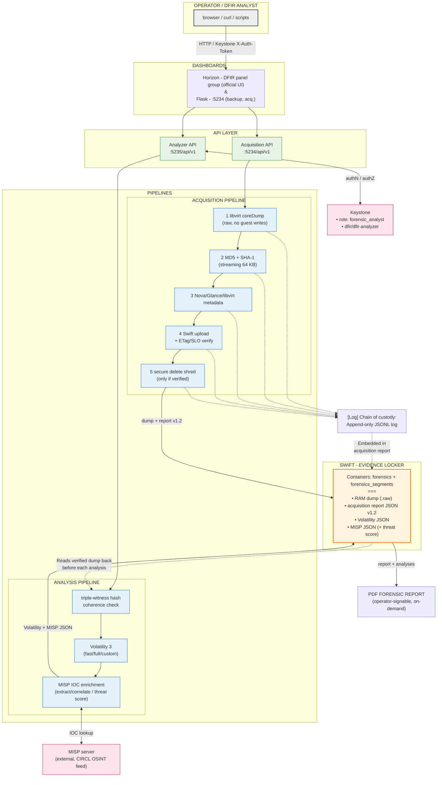
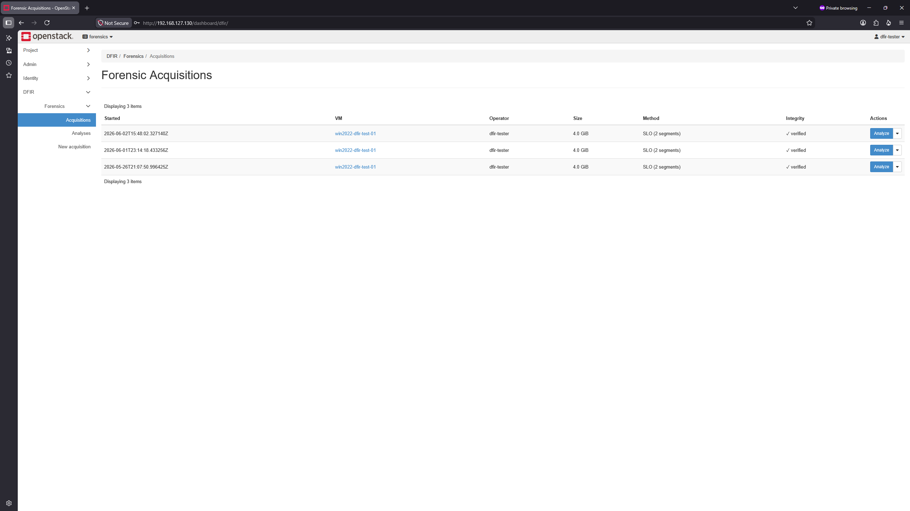
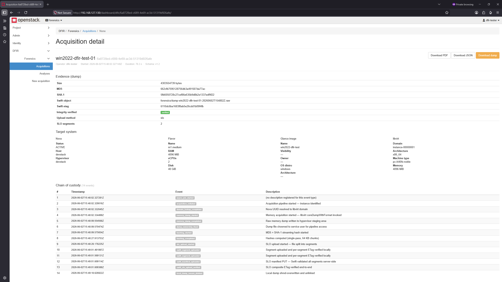
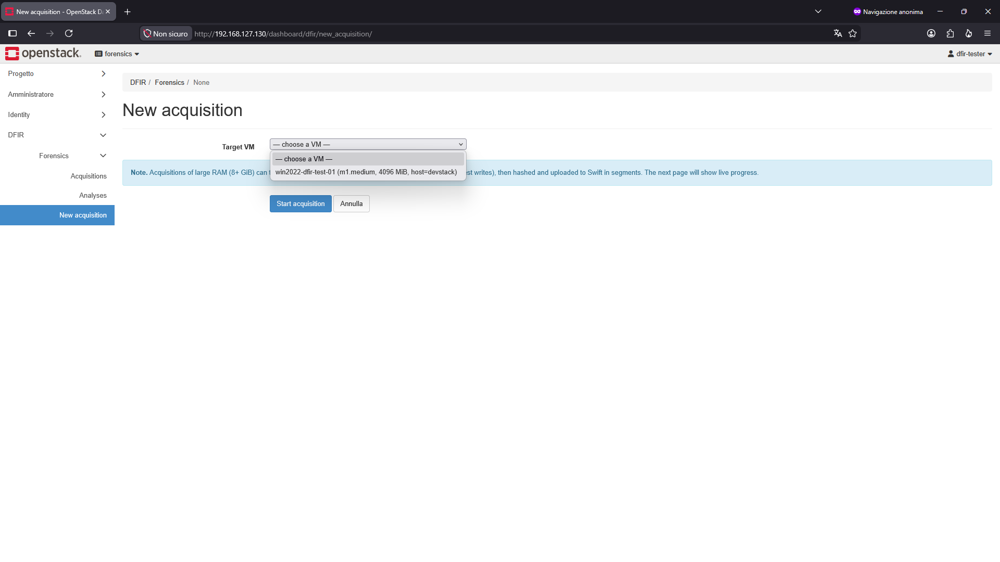
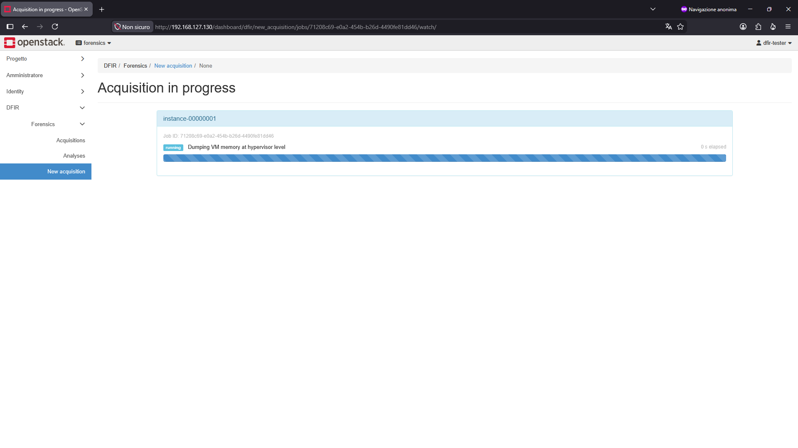
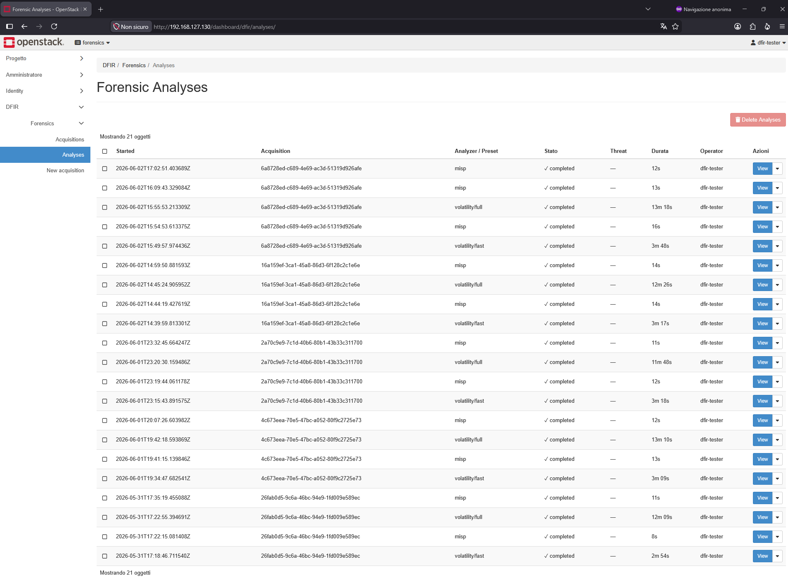
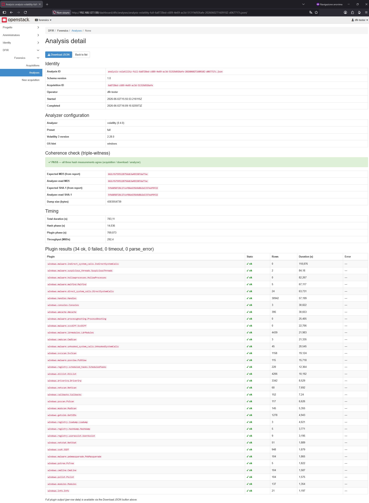
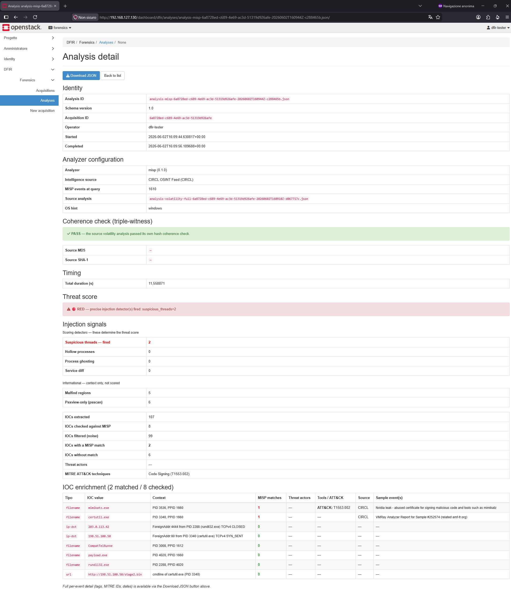
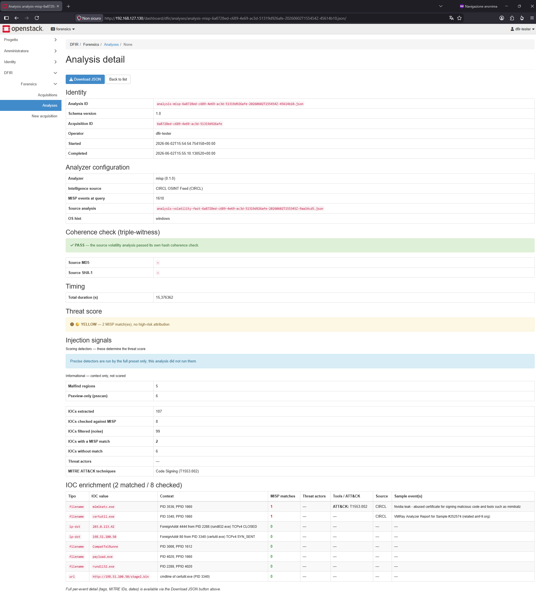
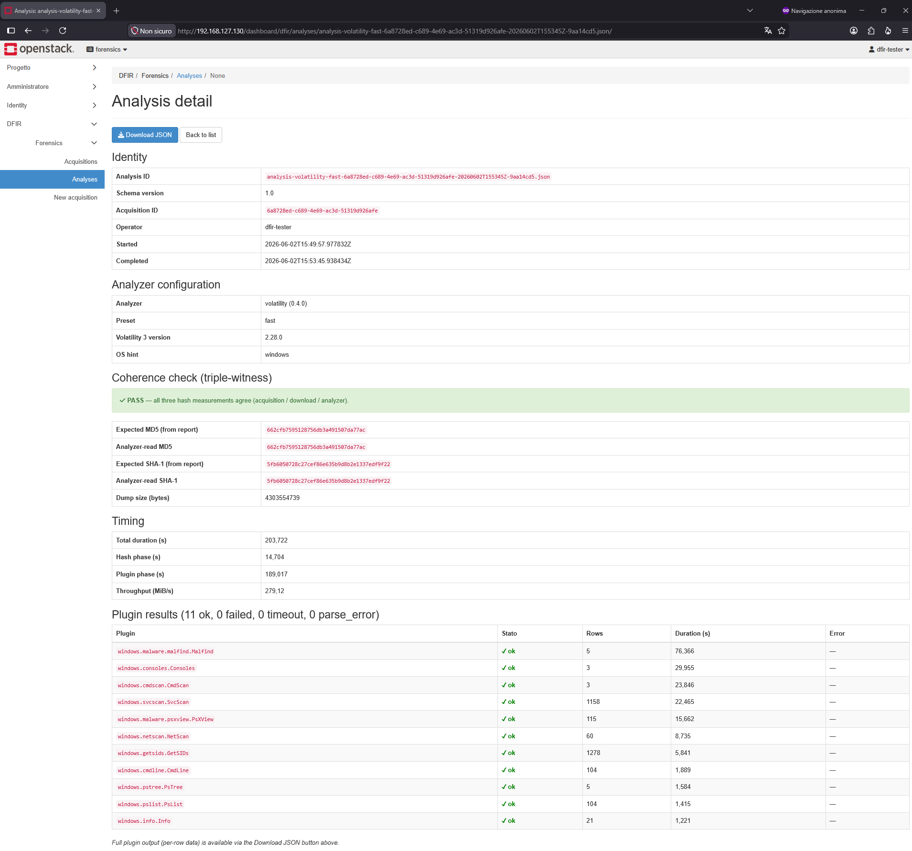

# ForensicNova

**DevStack plugin for forensically sound RAM acquisition and analysis of OpenStack guest VMs — hypervisor-level memory imaging, cryptographic chain of custody, Volatility 3 analysis, MISP threat-intelligence enrichment, on-demand signed PDF reporting.**

ForensicNova extends a stock OpenStack deployment with a dedicated digital-forensics service for incident response on tenant virtual machines. It acquires guest RAM at the hypervisor layer (zero footprint inside the guest), computes integrity hashes in streaming fashion on the hypervisor, persists the dump in Swift with end-to-end ETag verification, securely wipes the staging copy, and maintains an append-only chain-of-custody journal. The image is then analysed by a companion service that runs Volatility 3 (with `fast`, `full`, and `custom` presets) and correlates the extracted indicators of compromise against a MISP threat-intelligence instance, producing a per-IOC threat score, attribution to known actors / tools / ATT&CK techniques, and a feed-aware provenance record. The whole evidence chain — acquisition, analysis, intelligence — is presented through a Horizon panel group (the recommended UI) and through a per-acquisition signed PDF designed for operator countersignature and legal hand-off.

The intelligence extracted from the memory image is the core deliverable: the PDF and the dashboard are the two complementary views of that intelligence and stay aligned field by field.

ForensicNova is the M.Sc. thesis project for the *Sicurezza Informatica e Tecnologie Cloud* degree programme at the **University of Salerno (ISISLab)**. It originated as coursework for the *Piattaforme di Cloud Computing* course and was extended into a full DFIR pipeline.

---

## Table of contents

- [Forensic soundness](#forensic-soundness)
- [Architecture](#architecture)
- [Quick start](#quick-start)
- [Horizon dashboard](#horizon-dashboard)
- [Standalone Flask dashboard (legacy/backup)](#standalone-flask-dashboard-legacybackup)
- [REST API](#rest-api)
- [JSON report schemas](#json-report-schemas)
- [Forensic PDF report](#forensic-pdf-report)
- [Detection capability](#detection-capability)
- [Known limitations](#known-limitations)
- [Roadmap](#roadmap)
- [License](#license)

---

## Forensic soundness

ForensicNova is designed so that the memory image and its derived analyses are defensible in a judicial context. The acquisition pipeline behaves as a **natural write-blocker**: the guest filesystem is never touched, paged, or signaled, because libvirt reads RAM out-of-band on the hypervisor side (`coreDumpWithFormat()`); the operation is invisible to the guest OS by construction. The terminology and structure of the workflow follow **NIST SP 800-86** (*Guide to Integrating Forensic Techniques into Incident Response*, 2006), which articulates the four canonical phases — collection, examination, analysis, reporting — and recommends end-to-end cryptographic hashing without prescribing a specific algorithm.

Six guarantees are implemented and individually traceable in the chain-of-custody log:

| # | Guarantee | Implementation |
|---|---|---|
| 1 | **Zero bits written inside the guest** | Acquisition via libvirt `coreDumpWithFormat()` reading `/proc/<qemu-pid>/mem` on the hypervisor. No driver, agent, or hypervisor-side write reaches the guest OS. |
| 2 | **Hardened staging directory** | Temporary dump lands in `/var/lib/forensicnova/acquisitions/<uuid>/`, directory mode `0700`, dump file mode `0600`, owned by the service user `stack:stack`. Never in `/tmp`, never on the guest filesystem. |
| 3 | **Hashes computed on the hypervisor, before any transfer** | MD5 + SHA-1 (two independent algorithms, NIST 800-86 §3.2.2) computed in streaming over 64 KB chunks directly from the staging file. The hashes are persisted in the JSON report and re-verified by every downstream component. |
| 4 | **End-to-end ETag integrity check with Swift** | On `PUT`, Swift returns a server-side MD5. For single-object uploads the local MD5 is compared byte-for-byte; for Static Large Object uploads (≥ 4 GiB), a composite ETag is computed per segment and verified against the server response. Mismatch → pipeline aborted, the chain-of-custody flags `etag_verified: false` and the staging copy is preserved for debugging. |
| 5 | **Secure delete of the staging copy** | Once the upload is verified, the local dump is destroyed via `shred -u -n 1`. The hypervisor never retains a recoverable residue. |
| 6 | **Append-only chain of custody** | All pipeline events are written to `/var/log/forensicnova/chain-of-custody.jsonl` as JSON lines, with ISO-8601 UTC timestamps to microsecond precision and the Keystone operator identity attached to every event. The journal is the authoritative audit log and is also embedded in the final JSON report. |

**Triple-witness integrity.** The dump is hashed three independent times along its lifecycle: (1) on the hypervisor immediately after acquisition, by the acquisition backend (these are the authoritative hashes published in the JSON report); (2) by Swift, server-side, returned as ETag and verified end-to-end on upload; (3) by the analyzer backend, which re-downloads the dump from Swift and recomputes MD5 + SHA-1 before running any analysis, refusing to proceed unless its hashes match the report. Every analysis JSON carries a `coherence_check` field with the analyzer-read hashes and the `hashes_match_report` boolean — a third independent witness of integrity, produced after the evidence has crossed two service boundaries.

---

## Architecture

The deployment is a monorepo that wires **three DevStack services** plus an **external MISP threat-intelligence lab** that the plugin does not manage. Five systemd units are expected to be active in the demo configuration: `devstack@forensicnova` (acquisition backend on `:5234`), `devstack@forensicnova-analyzer` (analyzer backend on `:5235`), `apache2` (host for the Horizon dashboard, which runs as an Apache-served Django application), `docker` (container runtime for the MISP lab stack), and a standalone `forensicnova-misp.service` (the operator-managed MISP `docker compose` lifecycle). Two Swift containers hold all forensic evidence: `forensics` (acquisition reports, raw dumps, Volatility analyses, MISP analyses) and `forensics_segments` (per-segment SLO storage for dumps ≥ 4 GiB). Two Keystone services advertise the backends in the catalog: `dfir` (type `dfir`, the acquisition API) and `dfir-analyzer` (type `dfir-analyzer`, the analyzer API). A dedicated role `forensic_analyst` gates every authenticated endpoint, and the user `dfir-tester` is granted the role on the `forensics` project plus a cross-tenant `admin` grant on every other project so the operator can acquire RAM from any compromised VM without pre-knowing the tenant.


```mermaid
flowchart TD
    %% Style Definitions
    classDef actor fill:#eceff1,stroke:#37474f,stroke-width:2px;
    classDef api fill:#e8f5e9,stroke:#2e7d32,stroke-width:1px;
    classDef pipe fill:#e3f2fd,stroke:#1565c0,stroke-width:1px;
    classDef storage fill:#fff3e0,stroke:#ef6c00,stroke-width:2px;
    classDef external fill:#fce4ec,stroke:#c2185b,stroke-width:1px;

    %% Operator Layer
    subgraph OPERATOR_LAYER ["OPERATOR / DFIR ANALYST"]
        Op["browser / curl / scripts"]
    end
    class Op actor;

    %% Dashboards Layer
    subgraph DASHBOARDS_LAYER ["DASHBOARDS"]
        DB["Horizon - DFIR panel group (official UI)<br>&<br>Flask - :5234 (backup, acq.)"]
    end

    Op -->|HTTP / Keystone X-Auth-Token| DB

    %% API & Auth Layer
    subgraph API_LAYER ["API LAYER"]
        AcqAPI["Acquisition API<br>:5234/api/v1"]
        AnAPI["Analyzer API<br>:5235/api/v1"]
    end
    class AcqAPI,AnAPI api;

    DB --> AcqAPI
    DB --> AnAPI

    Keystone["Keystone<br>• role: forensic_analyst<br>• dfir/dfir-analyzer"]
    class Keystone external;
    AnAPI <-->|authN / authZ| Keystone

    %% Pipelines Layer
    subgraph PIPELINES ["PIPELINES"]
        subgraph ACQ_PIPE ["ACQUISITION PIPELINE"]
            P1["1 libvirt coreDump<br>(raw, no guest writes)"]
            P2["2 MD5 + SHA-1<br>(streaming 64 KB)"]
            P3["3 Nova/Glance/libvirt metadata"]
            P4["4 Swift upload<br>+ ETag/SLO verify"]
            P5["5 secure delete shred<br>(only if verified)"]
            
            P1 --> P2
            P2 --> P3
            P3 --> P4
            P4 --> P5
        end
        
        subgraph AN_PIPE ["ANALYSIS PIPELINE"]
            A1["triple-witness hash<br>coherence check"]
            A2["Volatility 3<br>(fast/full/custom)"]
            A3["MISP IOC enrichment<br>(extract/correlate / threat score)"]
            
            A1 --> A2
            A2 --> A3
        end
    end
    class P1,P2,P3,P4,P5,A1,A2,A3 pipe;

    AcqAPI --> P1
    AnAPI --> A1

    MISP["MISP server<br>(external, CIRCL OSINT feed)"]
    class MISP external;
    A3 <-->|IOC lookup| MISP

    %% Storage Layer (Evidence Locker)
    subgraph SWIFT_LAYER ["SWIFT - EVIDENCE LOCKER"]
        Swift["Containers: forensics + forensics_segments<br>===<br>• RAM dump (.raw)<br>• acquisition report JSON v1.2<br>• Volatility JSON<br>• MISP JSON (+ threat score)"]
    end
    class Swift storage;

    P5 -->|dump + report v1.2| Swift
    A3 -->|Volatility + MISP JSON| Swift
    
    %% Footnote 1
    Swift -.->|Reads verified dump back<br>before each analysis| A1

    %% Final Output
    PDF["PDF FORENSIC REPORT<br>(operator-signable, on-demand)"]
    Swift -->|report + analyses| PDF

    %% Chain of Custody Log
    CoC["[Log] Chain of custody:<br>Append-only JSONL log"]
    P1 -.-> CoC
    P2 -.-> CoC
    P3 -.-> CoC
    P4 -.-> CoC
    P5 -.-> CoC
    CoC -.->|Embedded in<br>acquisition report| Swift
```

**Crash isolation between backends.** The acquisition backend (`:5234`) and the analyzer backend (`:5235`) are deployed as separate Flask processes with separate virtualenvs (`.venv` and `.venv-analyzer`). A Volatility 3 crash on a malformed dump cannot interrupt an in-flight acquisition; an analyzer restart does not affect the acquisition pipeline; the two have independent systemd lifecycles and independent Keystone catalog entries. The Horizon dashboard plugin discovers both via Keystone catalog lookup and never hardcodes `host:port`.

**Why MISP is external.** The MISP stack (six containers: `misp-core`, `misp-modules`, `db`, `redis`, `mail`, `misp-guard`) has its own lifecycle, multi-gigabyte persistent volumes, and a startup time on the order of minutes. Folding it into `plugin.sh` would couple DevStack `stack.sh` runs to MISP boot health and pull/build several gigabytes on every fresh stack. ForensicNova treats MISP as an external prerequisite, just like Keystone or Swift: the operator brings it up once via `docker compose` and registers a `forensicnova-misp.service` systemd unit for persistence across reboots. The analyzer reads `/etc/forensicnova/misp.conf` and gracefully fails with a clear message if MISP is unreachable, so the acquisition pipeline keeps working even when MISP is down.

---

## Quick start

### Prerequisites

- Ubuntu 24.04 LTS host with hardware virtualization (KVM)
- DevStack `master` branch, tested against `2026.2`
- Python 3.12
- `stack` user with NOPASSWD sudo, membership in `libvirt` and `kvm` groups
- (Optional, for analyses) a reachable MISP instance — the plugin does **not** deploy MISP; see [MISP lab service](#misp-lab-service-external-not-managed-by-the-plugin) below

### `local.conf` snippet

The minimal lines needed to enable ForensicNova on top of an existing DevStack `local.conf`. For a fully-commented working example see [`local.conf.example`](local.conf.example) at the root of this repository.

```ini
[[local|localrc]]
ADMIN_PASSWORD=secret
DATABASE_PASSWORD=$ADMIN_PASSWORD
RABBIT_PASSWORD=$ADMIN_PASSWORD
SERVICE_PASSWORD=$ADMIN_PASSWORD

HOST_IP=<your-host-ip>
SERVICE_HOST=$HOST_IP
MYSQL_HOST=$SERVICE_HOST
RABBIT_HOST=$SERVICE_HOST
GLANCE_HOSTPORT=$SERVICE_HOST:9292

# Cinder off, Swift on (forensic artifacts live in object storage)
disable_service cinder c-api c-sch c-vol
enable_service s-proxy s-object s-container s-account
SWIFT_HASH=change_me_to_a_random_string
SWIFT_REPLICAS=1
SWIFT_DATA_DIR=/opt/stack/data/swift

# Size the Swift loopback to accommodate forensic dumps + their SLO segments.
# The DevStack default (~6 GB) is too small for any acquisition above 4 GB
# of RAM. 30 GB gives room for several acquisitions of an 8 GiB guest plus
# their analysis JSONs.
SWIFT_LOOPBACK_DISK_SIZE=30G

LIBVIRT_TYPE=kvm

# ForensicNova plugin
FORENSICNOVA_DFIR_PASSWORD=<your-dfir-password>
enable_plugin forensicnova https://github.com/numdav/forensicnova main
```

Replace `<your-dfir-password>` with the password you want to assign to the `dfir-tester` user. Replace `<your-host-ip>` with the IP address of your DevStack host. Set `SWIFT_HASH` to any random string of your choice — it must be stable across reboots of the same deployment.

The single `enable_plugin forensicnova` line enables **three** DevStack services from the same monorepo:

- `forensicnova` — the acquisition Flask REST backend on `:5234` (Keystone service type `dfir`)
- `forensicnova-analyzer` — the analyzer Flask REST backend on `:5235` (Keystone service type `dfir-analyzer`), runs Volatility 3 and the MISP enricher
- `forensicnova-dashboard` — the Horizon panel plugin

To deploy a subset, add `disable_service forensicnova-analyzer` and/or `disable_service forensicnova-dashboard` below the `enable_plugin` line.

### MISP lab service (external, not managed by the plugin)

MISP is a stand-alone Docker stack that the analyzer talks to over HTTPS. It is **not** deployed by `plugin.sh`; the operator brings it up via `docker compose` and (optionally) registers a `forensicnova-misp.service` systemd unit for persistence across boots. The analyzer reads `/etc/forensicnova/misp.conf` at startup to learn where MISP lives and how to authenticate:

```ini
[misp]
url            = https://127.0.0.1:10443
auth_key       = <44-char-key>
verify_cert    = false
timeout_seconds = 30
```

File permissions: `0600`, owner `stack:stack`. The `auth_key` is the per-user API key generated from the MISP web UI (Administration → List Auth Keys → New). `verify_cert = false` is appropriate for the lab because MISP ships a self-signed certificate; production deployments would set it to `true` with a CA bundle. `timeout_seconds` bounds each MISP query and lets the enricher degrade gracefully (log + skip the IOC) when the network is slow rather than blocking the whole pipeline.

Without this file the acquisition pipeline still works end-to-end and Volatility 3 analyses run; only the MISP enrichment analyzer fails fast on first invocation with a clear `MISP config not found` error.

### Stack and validate

```bash
cd /opt/stack/devstack
./stack.sh
```

Once the stack completes, verify the plugin is running. **Five systemd units** are expected active in the demo configuration:

```bash
# Five systemd units active (the last one only if MISP is deployed)
systemctl is-active devstack@forensicnova \
                    devstack@forensicnova-analyzer \
                    apache2 docker forensicnova-misp.service

# Health endpoints
curl http://<HOST_IP>:5234/health
# {"service":"forensicnova","status":"ok","version":"..."}

curl http://<HOST_IP>:5235/health
# {"service":"forensicnova-analyzer","status":"ok","version":"0.1.0"}

# Keystone service catalog
openstack service show dfir          -f value -c type   # dfir
openstack service show dfir-analyzer -f value -c type   # dfir-analyzer
```

### Access the dashboards

ForensicNova ships two operator UIs. The recommended one is the Horizon panel group, which covers the whole pipeline (acquisitions + analyses). The standalone Flask UI is a legacy of the project's earliest phase and only covers acquisitions; it is kept deployed as a backup.

**Horizon dashboard** (recommended). Open `http://<HOST_IP>/dashboard/` in a browser. After logging in as `dfir-tester`, expand the **DFIR** entry in the left sidebar to reach the **Forensics** panel group with three panels: **Acquisitions**, **Analyses**, **New acquisition**. See [Horizon dashboard](#horizon-dashboard) for the full panel-by-panel description.

**Standalone Flask dashboard (legacy)** at `http://<HOST_IP>:5234/dashboard/`. Covers acquisitions only. Useful as a fallback when the Horizon plugin is disabled. See [Standalone Flask dashboard (legacy/backup)](#standalone-flask-dashboard-legacybackup).

Credentials in both cases:

- **Username**: `dfir-tester`
- **Password**: the one set via `FORENSICNOVA_DFIR_PASSWORD`
- **Project**: `forensics`

---

## Horizon dashboard

The Horizon plugin registers a top-level **DFIR** dashboard in the OpenStack web console, with a **Forensics** panel group exposing three panels. It is installed in editable mode (`pip install -e`) into Horizon's venv at plugin extra-phase and registers its panels via `_9NNN_*.py` drop-ins under `/opt/stack/horizon/openstack_dashboard/local/enabled/`. The dashboard discovers both backend endpoints via Keystone catalog lookup (service types `dfir` and `dfir-analyzer`); no `host:port` is hardcoded anywhere.

### Acquisitions panel



Lists every acquisition stored in the `forensics` Swift container, one row per acquisition. Columns: start time, VM name, operator, dump size (humanized), upload method (`single_put` for dumps < 4 GiB, or `slo` with a segment count for larger dumps verified end-to-end), and integrity status. Per-row actions: **Analyze** (trigger a Volatility 3 job on this acquisition), download PDF, download JSON, download raw dump.

Clicking a row opens the acquisition detail:



The detail view renders the full JSON report (schema v1.2): timestamps with microsecond precision, full `target_system` block (Nova + Glance + libvirt XML), dump metadata with both hashes and the verified Swift ETag, the complete chain of custody as an ordered event timeline, and the per-segment SLO listing for large dumps.

### New acquisition panel



A form with a single dropdown listing all Nova instances visible to the analyst — cross-tenant, because `dfir-tester` carries the `admin` role on every project (see [Known limitations](#known-limitations)). Inactive (non-`ACTIVE`) instances are listed but disabled, because libvirt's `coreDumpWithFormat()` requires a running domain.

Submitting the form triggers the async pipeline and redirects to a watch page that polls `/api/v1/jobs/<id>` every 2 seconds, showing live status, the current human-readable phase label (e.g. `"Uploading dump (segment 2 of 3)"` for SLO acquisitions), and elapsed seconds:



On completion the browser is redirected to the acquisition detail page; on failure, the error message from the backend is displayed inline.

### Analyses panel



Lists every analysis (Volatility 3 or MISP enrichment) stored in the `forensics` Swift container. Columns: started timestamp, parent acquisition (UUID prefix), analyzer + preset, status, threat score (for MISP enrichments), duration, operator. Per-row action: open the detail page.

The Volatility detail page shows the per-plugin summary, the triple-witness coherence check, the Volatility 3 version, and OS hint:



The MISP enrichment detail page is where the threat-intelligence story is told. It exposes (in this order): the **Intelligence source** (the MISP feeds that were enabled at the time of the query, e.g. *CIRCL OSINT Feed (CIRCL)*); the **MISP events at query** count (how many events the MISP database held when the IOCs were checked — context for the match probability); the **threat score** with the firing rule shown in plain English (e.g. *RED — high-risk galaxy match: Tool:Meterpreter - S0500*); the **injection signals** breakdown (scoring detectors that drive the score vs informational signals shown for context only); and the **IOC enrichment** table, the analyst-facing summary of every IOC extracted from the dump:



The IOC enrichment table has one row per IOC, with: type (`filename` / `ip-dst` / `url` / `sha256`), value, **context** (where the IOC came from inside the dump — e.g. `ForeignAddr:4444 from PID 2288 (rundll32.exe) TCPv4 CLOSED` for a network IOC, or `PID 3536, PPID 1660` for a process), MISP match count, threat actors (galaxy clusters), tools / ATT&CK techniques, **source** (which feed-provider organisation supplied the matching event, e.g. *CIRCL* or *ForensicNova* for locally curated events), and sample event(s) with their `info` strings. The `Source` column is per-IOC and is read from the matched event's creator organisation (`Orgc`) as a proxy for the feed it came from — see [Known limitations](#known-limitations) for the caveat.

Same panel, different evidence — a *YELLOW* score (1-5 matches, behavioural but not attributed):



And a *RED* score driven by behavioural signals alone (no attribution feed, but the `full` Volatility preset has fired the precise injection detectors):


The dashboard is aligned **field by field** with the PDF report (see [Forensic PDF report](#forensic-pdf-report)): every datum visible in the dashboard is also in the PDF, and vice versa. The dashboard adds one extra column (`Sample event(s)`) which the PDF folds into the Attribution column for compactness.

### Authentication flow

The Horizon plugin forwards the operator's Keystone token in `X-Auth-Token` to the ForensicNova REST APIs. Keystone enforces the `forensic_analyst` role, which Horizon's permission middleware also checks at the URL-routing layer (the URLs are unreachable without the role). The polling JavaScript for the watch page goes through a server-side proxy view, so the browser session cookie is sufficient on the JS side — the Keystone token never leaves the server.

---

## Standalone Flask dashboard (legacy/backup)

The standalone Flask dashboard is the in-service UI that ships with the acquisition backend on `:5234`. It is a session-authenticated Flask blueprint and **only covers the acquisition workflow** — it predates the analyzer and does not expose Volatility / MISP analyses. It remains deployed as a backup for environments where the Horizon plugin is unavailable. The recommended UI is the Horizon panel group above.

Access it at `http://<HOST_IP>:5234/dashboard/` with the same `dfir-tester` credentials and the `forensics` project. Functionally it covers: login, acquisitions list, new acquisition form (with confirmation modal), watch page during the acquisition, acquisition detail with the JSON report rendered in a human-readable layout, and download links for raw dump, JSON, and PDF.

---

## REST API

ForensicNova exposes two HTTP backends on the same host. Both are protected by Keystone token authentication (`X-Auth-Token` header) and the `forensic_analyst` role. The acquisition backend on `:5234` drives the dump pipeline and produces the PDF (now extended with all Volatility and MISP analyses associated with the acquisition). The analyzer backend on `:5235` runs Volatility 3 and the MISP enricher. The Horizon dashboard discovers both via Keystone catalog lookup; clients should do the same.

### Acquisition backend — `:5234`

| Method | Path | Auth | Description |
|---|---|---|---|
| `GET` | `/health` | none | Service liveness probe. |
| `POST` | `/api/v1/servers/<id>/memory_acquire` | token | Triggers RAM acquisition on Nova instance `<id>`. Returns `202 Accepted` with a `job_id`. |
| `GET` | `/api/v1/servers/` | token | Lists all Nova instances visible to the authenticated user (cross-tenant for `forensic_analyst`). |
| `GET` | `/api/v1/jobs/` | token | Lists acquisition jobs, most recent first. |
| `GET` | `/api/v1/jobs/<job_id>` | token | Returns the current job record (`status`, `phase`, `label`, `elapsed_seconds`, `result` on completion). Designed for 2-second polling. |
| `GET` | `/api/v1/acquisitions/` | token | Lists all acquisitions in the Swift evidence container with summary metadata. |
| `GET` | `/api/v1/acquisitions/<id>` | token | Returns the full JSON report (schema v1.2) for acquisition `<id>`. |
| `GET` | `/api/v1/acquisitions/<id>/dump` | token | Streams the raw dump file (`.raw`). Constant memory on the server side; multi-gigabyte transfers are safe. |
| `GET` | `/api/v1/acquisitions/<id>/report` | token | Returns the JSON report as a downloadable attachment. |
| `GET` | `/api/v1/acquisitions/<id>/report.pdf` | token | On-demand renders the PDF forensic report. The PDF now bundles **the acquisition + all Volatility 3 analyses + all MISP enrichments** linked to this acquisition by `acquisition_id`. Each invocation produces a new PDF with its own UTC `CreationDate`; the underlying JSON records remain the canonical source of truth. |

### Analyzer backend — `:5235`

| Method | Path | Auth | Description |
|---|---|---|---|
| `GET` | `/health` | none | Service liveness probe. |
| `POST` | `/api/v1/analyses` | token | Triggers a Volatility 3 analysis on an existing acquisition. Body: `{"acquisition_id": "<uuid>", "preset": "fast"\|"full"\|"custom", "plugins": [...]}`. Returns `202 Accepted` with a `job_id`. |
| `POST` | `/api/v1/misp-enrichments` | token | Triggers a MISP enrichment on an existing Volatility analysis. Body: `{"input_analysis_id": "analysis-volatility-...json"}`. Returns `202 Accepted` with a `job_id`. |
| `GET` | `/api/v1/analyses/` | token | Lists all analyses (Vol3 + MISP) stored in Swift. |
| `GET` | `/api/v1/analyses/by-id/<analysis_id>` | token | Returns the full JSON for one analysis (Vol3 or MISP). |
| `GET` | `/api/v1/analyses/by-acquisition/<acquisition_id>` | token | Lists all analyses linked to a given acquisition. |
| `GET` | `/api/v1/jobs/` | token | Lists analyzer jobs (Vol3 + MISP), most recent first. |
| `GET` | `/api/v1/jobs/<job_id>` | token | Job status, designed for polling. |

### End-to-end example: acquire, analyze, enrich, export PDF

```bash
# Obtain a Keystone token scoped to the forensics project
TOKEN=$(openstack token issue -f value -c id)
HOST=<HOST_IP>

# 1) Async acquisition trigger — returns 202 with a job_id
JOB_ID=$(curl -sX POST \
     -H "X-Auth-Token: $TOKEN" \
     http://$HOST:5234/api/v1/servers/<instance-uuid>/memory_acquire \
     | jq -r .job_id)

# Poll until complete (acquisition backend)
while true; do
  JOB=$(curl -s -H "X-Auth-Token: $TOKEN" \
        http://$HOST:5234/api/v1/jobs/$JOB_ID)
  STATUS=$(echo "$JOB" | jq -r .status)
  LABEL=$(echo "$JOB" | jq -r .label)
  echo "[acquisition $STATUS] $LABEL"
  [[ "$STATUS" == "completed" || "$STATUS" == "failed" ]] && break
  sleep 2
done
ACQ_ID=$(echo "$JOB" | jq -r .result.acquisition_id)

# 2) Trigger a Volatility full analysis on the acquisition
VOL_JOB=$(curl -sX POST \
     -H "X-Auth-Token: $TOKEN" -H "Content-Type: application/json" \
     -d "{\"acquisition_id\": \"$ACQ_ID\", \"preset\": \"full\"}" \
     http://$HOST:5235/api/v1/analyses \
     | jq -r .job_id)

# Poll until complete (analyzer backend)
while true; do
  J=$(curl -s -H "X-Auth-Token: $TOKEN" \
       http://$HOST:5235/api/v1/jobs/$VOL_JOB)
  [[ $(echo "$J" | jq -r .status) =~ ^(completed|failed)$ ]] && break
  sleep 5
done
VOL_ANALYSIS_ID=$(echo "$J" | jq -r .result.analysis_id)

# 3) Trigger a MISP enrichment on the Volatility analysis
MISP_JOB=$(curl -sX POST \
     -H "X-Auth-Token: $TOKEN" -H "Content-Type: application/json" \
     -d "{\"input_analysis_id\": \"$VOL_ANALYSIS_ID\"}" \
     http://$HOST:5235/api/v1/misp-enrichments \
     | jq -r .job_id)

# Poll until complete
while true; do
  J=$(curl -s -H "X-Auth-Token: $TOKEN" \
       http://$HOST:5235/api/v1/jobs/$MISP_JOB)
  [[ $(echo "$J" | jq -r .status) =~ ^(completed|failed)$ ]] && break
  sleep 5
done

# 4) Download the combined PDF (acquisition + all analyses for this acquisition)
curl -sH "X-Auth-Token: $TOKEN" \
     http://$HOST:5234/api/v1/acquisitions/$ACQ_ID/report.pdf \
     -o "report-$ACQ_ID.pdf"
```

---

## JSON report schemas

ForensicNova produces three JSON schemas. Acquisition reports use schema **v1.2** (a forward-compatible extension of v1.1 that adds `dump.upload_method` and `dump.slo_segments`). Volatility and MISP analyses use schema **1.0**. All three are stored in the same `forensics` Swift container and linked together via `acquisition_id`, which is the only stable cross-schema identifier (the per-record `analysis_id` is not stable: Volatility includes a `.json` suffix in the field while MISP does not — never join on `analysis_id`).

### Acquisition report — `report-<sanitized_vm>-<UTC>.json` (v1.2)

Trimmed to the forensically meaningful fields; the full structure mirrors `app/reports/json_report.py`.

```jsonc
{
  "schema_version": "1.2",
  "acquisition_id": "<uuid4>",
  "operator":       "dfir-tester",
  "tool": { "name": "ForensicNova", "version": "0.1.0" },
  "timestamps": {
    "started_at":       "2026-05-31T17:18:23.482015Z",
    "completed_at":     "2026-05-31T17:21:11.094277Z",
    "duration_seconds": 167.61
  },
  "target_system": {
    "nova":     { "id": "...", "name": "win2022-dfir-target", "status": "ACTIVE", "host": "devstack", ... },
    "flavor":   { "id": "...", "name": "ds4G", "vcpus": 2, "ram_mb": 4096, "disk_gb": 25 },
    "glance":   { "id": "...", "name": "win2022-dfir-test", "os_distro": "windows", ... },
    "libvirt":  { "domain_name": "instance-00000007", "architecture": "x86_64", "memory_mb": 4096, ... }
  },
  "dump": {
    "size_bytes":         4297064448,
    "md5":                "<hex>",
    "sha1":               "<hex>",
    "format":             "elf64",
    "acquisition_method": "libvirt-coreDumpWithFormat",
    "swift_object":       "forensics/dump-win2022-dfir-target-20260531T171823Z.raw",
    "swift_etag":         "<composite-hex>-2",
    "etag_verified":      true,
    "upload_method":      "slo",
    "slo_segments": [
      { "index": 1, "name": "...seg-0001", "size": 4294967296, "md5": "<hex>", "etag": "<hex>" },
      { "index": 2, "name": "...seg-0002", "size":    2097152, "md5": "<hex>", "etag": "<hex>" }
    ]
  },
  "chain_of_custody": {
    "total_events": 14,
    "events": [ /* numbered, timestamped event timeline */ ]
  }
}
```

### Volatility analysis — `analysis-volatility-<preset>-<acq>-<UTC>-<job8>.json` (1.0)

```jsonc
{
  "schema_version": "1.0",
  "analysis_id":    "analysis-volatility-fast-...json",  // includes .json suffix
  "acquisition_id": "<uuid4>",                            // STABLE link to acquisition
  "analyzer":         "volatility",
  "analyzer_version": "0.4.0",
  "preset":           "fast",            // fast | full | custom
  "operator":         "dfir-tester",
  "input_dump": {
    "swift_object": "forensics/dump-...raw",
    "size_bytes":   4297064448
  },
  "timestamps": {
    "started_at":   "2026-05-31T17:21:41.000Z",
    "completed_at": "2026-05-31T17:23:55.000Z"
  },
  "coherence_check": {
    "hashes_match_report": true,        // triple-witness PASS
    "analyzer_read_md5":   "<hex>",
    "analyzer_read_sha1":  "<hex>"
  },
  "plugins": null,                       // NULL at top level — actual results live under result.plugins
  "result": {
    "vol3_version": "2.28.0",
    "os_hint":      "windows",
    "summary_counts": { "ok": 11, "failed": 0, "timeout": 0, "parse_error": 0 },
    "plugins": {
      "windows.pslist.PsList":   { "status": "ok", "row_count": 102, "duration_seconds": 8.2, "rows": [...] },
      "windows.netscan.NetScan": { "status": "ok", "row_count":  94, "duration_seconds": 7.8, "rows": [...] },
      "windows.malfind.Malfind": { "status": "ok", "row_count":  14, "duration_seconds": 12.4, "rows": [...] }
      // ... all executed plugins
    }
  }
}
```

### MISP analysis — `analysis-misp-<acq>-<UTC>-<job8>.json` (1.0)

```jsonc
{
  "schema_version":     "1.0",
  "analysis_id":        "analysis-misp-...",     // no .json suffix
  "acquisition_id":     "<uuid4>",                // STABLE link to acquisition
  "analyzer":           "misp",
  "analyzer_version":   "0.1.0",
  "started_at":         "2026-06-03T22:36:38.306175Z",   // top-level (NOT under timestamps)
  "completed_at":       "2026-06-03T22:36:50.200475Z",
  "duration_seconds":   11.89,
  "source": {
    "analysis_id":         "analysis-volatility-fast-...json",
    "hashes_match_report": true                   // re-verified coherence
  },
  "misp_server": {
    "url": "https://127.0.0.1:10443",
    "events_count_at_query": 1613,
    "feeds": [                                    // captured at query time, drives Intelligence source
      { "name": "CIRCL OSINT Feed", "provider": "CIRCL", "url": "https://...",
        "enabled": true, "caching_enabled": true }
    ]
  },
  "iocs_extracted": 107,
  "enrichment": [
    {
      "ioc_type":    "filename",
      "ioc_value":   "mimikatz.exe",
      "context":     "PID 3536, PPID 1660",        // where the IOC came from inside the dump
      "misp_match":  2,
      "events": [
        {
          "event_id": 17,
          "info":     "Nvidia leak - abused certificate for signing malicious code and tools such as mimikatz",
          "org":      "CIRCL",                      // proxy for the feed source (see Known limitations)
          "galaxies": [{ "value": "Tool:Mimikatz" }],
          "attribution": { "actor": null, "actor_hint": null },
          "tags":     ["tlp:white", "misp-galaxy:tool=\"Mimikatz\"", "..."]
        }
        // ...
      ]
    }
    // ... one entry per IOC, including those with zero matches
  ],
  "injection_signals": {                            // populated by analyzer from Vol3 malware plugins
    "malfind_regions":      14,                     // informational, not scored
    "psxview_only_psscan":   8,                     // informational
    "suspicious_threads":    2,                     // SCORING: drives threat-score rule R2
    "hollow_processes":      0,
    "process_ghosting":      0,
    "service_diff":          0
  },
  "summary": {
    "threat_score":          "red",                 // green | yellow | red
    "threat_score_reason":   "high-risk galaxy match: Tool:Meterpreter - S0500",
    "iocs_checked":          8,
    "iocs_filtered":         99,                    // RFC1918 / MS-CDN / native processes / system DLLs
    "iocs_with_match":       5,
    "iocs_without_match":    3,
    "unique_actors":         ["UNC-FNDEMO"],
    "unique_galaxies":       ["Tool:Mimikatz", "Tool:Meterpreter - S0500"],
    "unique_attck":          ["T1003", "T1055", "T1071", "T1105", "T1553.002"]
  }
}
```

The triple-witness coherence check (`coherence_check.hashes_match_report` on the Volatility analysis, `source.hashes_match_report` on the MISP analysis) is computed independently in each backend by re-reading the dump from Swift and re-hashing it — it is the third witness of integrity after the acquisition backend (witness 1) and the Swift server (witness 2). Any tampering with the dump in storage trips this check before any analysis runs.

---

## Forensic PDF report

Each acquisition has exactly **one PDF**, generated on demand from the canonical JSON records. The PDF bundles the acquisition report **plus every Volatility 3 analysis and every MISP enrichment** that share the same `acquisition_id`, ordered as Volatility (extraction) then MISP (correlation), chronological within each group. It is rendered by ReportLab from a sequence of `render_*` building blocks (`app/reports/pdf_report.py`), each producing a self-contained Flowable list, and is **not** part of the asynchronous pipeline — generation happens on `GET /api/v1/acquisitions/<id>/report.pdf` (or via the corresponding action in the Horizon dashboard).

The title on the cover and in every page header is *Volatile memory forensic report*. The PDF is laid out as:

- **Cover page** — three stacked blocks. *Acquisition identity*: a key-value table covering acquisition UUID, operator (Keystone username), target VM (name, UUID, libvirt domain), timeline (started, completed, duration), MD5, SHA-1, integrity verification outcome, tool name+version, and report schema. *Document generation*: PDF build timestamp (UTC), generator identity, document type. *Operator signature block*: physical signature lines for a printed countersignature — block-capitals full name, with `authenticated as Keystone user: <op>` underneath as a binding to the immutable Keystone session identity, plus lines for date/place and the ink signature.

- **Evidence** — key-value table with Swift object name, container, size (humanized + bytes), format, acquisition method, MD5, SHA-1, Swift ETag, ETag-verified outcome, and upload method. For SLO uploads, a sub-table lists every segment (index, name, size, MD5/ETag merged into one column when they coincide, separated only when they genuinely differ).

- **Target system** — four sub-blocks (Nova, Flavor, Glance, Hypervisor & libvirt) with the OpenStack-side metadata that an analyst uses to select the right Volatility 3 profile / ISF. No data is ever read from inside the guest.

- **Chain of custody** — numbered timeline table (`seq`, timestamp, event type, description). Failure events (`*_failed`, `integrity_failure`) are rendered in red. The per-event JSON payloads are intentionally **not** dumped (they duplicate information already shown in Evidence and hashes); the full record lives in the downloadable JSON.

- **Analysis** — dispatcher section that iterates over every analysis associated with the acquisition. Volatility 3 sections (one per analysis) are rendered **light**: a meta table (preset, Vol3 version, OS hint, duration, coherence check + analyzer-read MD5/SHA-1), a summary counts line (`Plugins executed: N ok, M failed, ...`), and a per-plugin table (name, status, row count, duration, error). Per-plugin rows are not dumped in the PDF — they live in the downloadable JSON, since dumping hundreds of plugin rows would bury the analyst-meaningful summary. MISP enrichment sections (one per analysis) are rendered **rich**: the *Intelligence source* line (feeds enabled at query time, e.g. *CIRCL OSINT Feed (CIRCL)*), the *MISP events at query* count, the threat-score box (green / yellow / red, with the firing rule in plain English), the injection-signals breakdown (scoring vs informational), an aggregate summary (Tools, ATT&CK techniques by code + name, Threat actors), and the **IOC enrichment table** — one row per IOC with type, value, match count, attribution (actor · galaxy · ATT&CK · `src: <feed-provider>`), and context (where the IOC came from inside the dump). The attribution `src:` line for each IOC is the per-IOC source mapped from the matched event's creator organisation; the section-level *Intelligence source* is the section-wide feeds list.

- **Notice** — five paragraphs of legal disclaimer covering: (1) the role of the PDF relative to the canonical JSON + RAW evidence; (2) the cryptographic integrity guarantees (streaming MD5+SHA-1 at hypervisor, end-to-end ETag, triple-witness in each analysis, the chain-of-custody journal); (3) the threat-intelligence caveat — every match is only as authoritative as the feed that supplied it, and the *Intelligence source* field records that provenance; (4) the "distinct print event" property — every regeneration is byte-different with its own `CreationDate`, while the underlying evidence is fixed; (5) the academic-prototype status of the project.

**Headers and footers on every page** are rendered through a two-pass `NumberedCanvas` so the footer can show `page X of Y`: top band has the title (*ForensicNova — volatile memory forensic report*) on the left and operator identity on the right; bottom band has the full acquisition UUID on the left and `page X of Y` on the right.

---

## Detection capability

This section is the empirical answer to "does the detector see what it is supposed to see?". Four scenarios were validated end-to-end on a Windows Server 2022 Standard Evaluation guest (build 10.0.20348.587), with the dump acquired via the standard ForensicNova acquisition pipeline and analysed via Volatility 3 (presets `fast` and `full`) and the MISP enricher. The scenarios are ordered from a clean baseline to a fully attributed compromise, to show how the detector escalates as more evidence becomes available.

### Stage 1 — GREEN baseline (clean Windows guest)

A freshly-OOBE'd Windows Server 2022 guest with no user-mode activity beyond the standard desktop session (Edge, Notepad). The acquisition pipeline produces a 4 GiB dump in ~5 seconds; the `fast` preset of Volatility 3 produces ~100 IOC candidates. After the anti-noise filter (RFC 1918, Microsoft CDN ranges, known Windows-native processes, system DLL paths), 2 IOCs survive (`notepad.exe`, `msedge.exe`, both anagrafici); both are queried against MISP and return zero matches; threat score is **GREEN**. This is the negative control — no false positives on a clean image.

### Stage 2 — YELLOW with a vanilla MISP feed (CIRCL only)

The same plugin pipeline but on a dump infected with Mimikatz + Meterpreter reverse_tcp (`LHOST=203.0.113.42`, TEST-NET-3 per RFC 5737) + a `certutil.exe` cradle for a stage-2 payload. The MISP instance is configured with the **CIRCL OSINT Feed** only — no curated demo events. The enricher extracts 8 checkable IOCs (filenames, foreign IPs, command lines); CIRCL's OSINT corpus contains events on `mimikatz.exe` and `certutil.exe`, so 2 matches fire. Threat score is **YELLOW** (rule R4: 1-5 matches).


This is the realistic open-source baseline: behavioural intelligence on broadly-known tools, no specific attribution.

### Stage 3 — RED on behavioural signals alone (full preset)

Same infected dump, but the `full` Volatility preset is run. The precise injection detectors are now active: `suspicious_threads` fires with count 2 (the Meterpreter migration target), which trips threat-score rule R2 and pushes the score to **RED** regardless of MISP matches. The two CIRCL matches from Stage 2 are still there, but they are no longer what drives the score — the behavioural signal is the ground truth.


This is the demonstration that the detector does **not** require a feed to surface a serious incident: the precise injection detectors are sufficient. The feed adds attribution; it does not gate detection.

### Stage 4 — RED with attribution (sensitivity demo)

To illustrate how the detector behaves against a more capable feed — one that has indexed the exact tools and infrastructure of this campaign — a small set of MISP events tagged `simulated` was loaded into the lab MISP, mapped onto the exact IOCs observed in the dump (`mimikatz.exe`, `203.0.113.42`, the stage-2 URL, …) and decorated with realistic actor / galaxy / ATT&CK assignments (`UNC-FNDEMO`, `Tool:Meterpreter - S0500`, `T1003`, `T1055`, `T1071`, `T1105`, `T1553.002`). With this richer intelligence available, the enricher escalates from R2 (behavioural) to R1 (high-risk galaxy match), matches rise from 2 to 5, the attribution column is fully populated, and every event explicitly carries the `[SIMULATED] ... NOT live commercial data` marker so the demo is unambiguously distinguishable from a real intelligence find.


This is a *sensitivity* result: same dump, same Volatility output, same detection rules — only the intelligence quality changes. The detector visibly scales with feed quality, while remaining honest about which datapoints came from a curated demo set and which came from a public feed (the per-IOC *Source* column distinguishes *CIRCL* from *ForensicNova*).

### Preset comparison

The same dump can be analysed with either the `fast` preset (~11 plugins, ~30 seconds, behavioural signals only via informational counters) or the `full` preset (~34 plugins, ~10 minutes, with the precise injection detectors). The fast preset is appropriate for triage and routine sweeps; the full preset is the deeper dive that lets behavioural rules (R2) trip on their own.




The triple-witness coherence check is identical on both presets (the dump is hashed once in each analyzer run); the analyses differ only in which Volatility plugins are executed.

---

## Known limitations

The prototype intentionally accepts a small number of documented limitations that do not affect the forensic soundness of individual acquisitions.

### DevStack-only: Swift data lost after `unstack → stack`

Swift uses the Keystone project UUID as its storage namespace (`AUTH_<project_id>`). In DevStack, `./unstack.sh` followed by `./stack.sh` destroys and recreates Keystone projects with fresh UUIDs, making previously stored Swift objects orphan in namespaces that no longer exist. The underlying `swift.img` filesystem is preserved, but the data is unreachable through the Swift API. **In a production OpenStack deployment, project UUIDs are stable for the lifetime of the cloud and Swift objects persist indefinitely.** Plain reboots of the host do not cause data loss; only the explicit `unstack → stack` sequence does.

### Cross-tenant forensic analyst privileges

To query Nova and Glance metadata for VMs owned by any tenant, `dfir-tester` is granted the `admin` role on every Keystone project by the plugin. This matches the operational reality of an incident responder who does not pre-know which tenant owns a compromised VM. A finer-grained `policy.yaml`-based scoping for Nova and Glance was explored early in the project but proved incompatible with Nova 2026.2's `enforce_new_defaults=True` regime — the override was abandoned and the broader admin grant kept as a documented workaround. Tightening this grant on a Nova release with stable policy support is listed in the [Roadmap](#roadmap).

### Windows-only analysis

The analyzer's Volatility presets target Windows guests (the demo platform is Windows Server 2022), and the MISP enrichment explicitly refuses non-Windows dumps (`os_hint != "windows"` → fail-fast). Linux dumps are out of scope for this thesis. The acquisition pipeline itself is OS-agnostic — only the analysis side is Windows-only.

### MISP feed attribution via event creator

The per-IOC *Source* column and the section-level *Intelligence source* shown in the dashboard and PDF use the matched event's creator organisation (`Orgc`) as a proxy for the feed the event came from. For events imported from a feed this coincides with the feed provider (e.g. *CIRCL*); a manually created event by an organisation that also publishes a feed would still be attributed to the organisation. The strict event-to-feed mapping is available via MISP's feed-correlation API and is left as future work.

### Large acquisitions and the Swift loopback

Dumps below 4 GiB are uploaded with a single Swift `PUT` and verified end-to-end against the server-returned ETag; dumps at or above 4 GiB are uploaded as a Swift Static Large Object (SLO), split into 4 GiB segments stored in `<container>_segments`, with a composite ETag verified end-to-end. There is no hard cap on guest RAM size. In DevStack the Swift backend is a loopback file whose default size (~6 GB) is too small for any 8 GiB acquisition; the provided `local.conf.example` sets `SWIFT_LOOPBACK_DISK_SIZE=30G`.

### Nova/libvirt state desync after host boot

After a reboot of the hypervisor, Nova reports guests as `SHUTOFF` by default (`resume_guests_state_on_host_boot=False`). This is intended DevStack behaviour, not a bug. Guests must be explicitly started via `openstack server start <name>` before an acquisition can succeed.

---

## Roadmap

Possible directions for future development, building on the current code without breaking changes:

- **YARA-based triage of memory dumps** — signature scanning of in-memory regions against known malware families and custom threat-actor rules, feeding the existing `analysis` section of the report alongside Volatility and MISP findings.
- **Hash-based MISP correlation for in-memory binaries** — extend the IOC extractor with imphash (and other relocation-immune signatures) of PE images recovered from memory, to complement the current behavioural matching.
- **Linux dump support** — extend the Volatility preset catalogue and lift the `os_hint == "windows"` guard on the MISP enricher.
- **Strict feed-to-event mapping** — replace the `Orgc`-as-proxy attribution with MISP's feed-correlation API, so the per-IOC *Source* column distinguishes the matched feed object from the event creator.
- **Cumulative case-level PDF** — bundle multiple acquisitions in a single signed forensic report with a deterministic cover sheet for legal hand-off, reusing the `render_*` building blocks of the per-acquisition PDF.
- **Production-grade hardening** — replace the Werkzeug development server with `gunicorn` / `uWSGI`, and tighten the cross-tenant grant via a `policy.yaml` override on Nova releases where policy overrides remain compatible.

---

## License

To be defined, likely Apache-2.0 for consistency with the OpenStack ecosystem.

**Author**: Davide Numelli — GitHub [@numdav](https://github.com/numdav)
