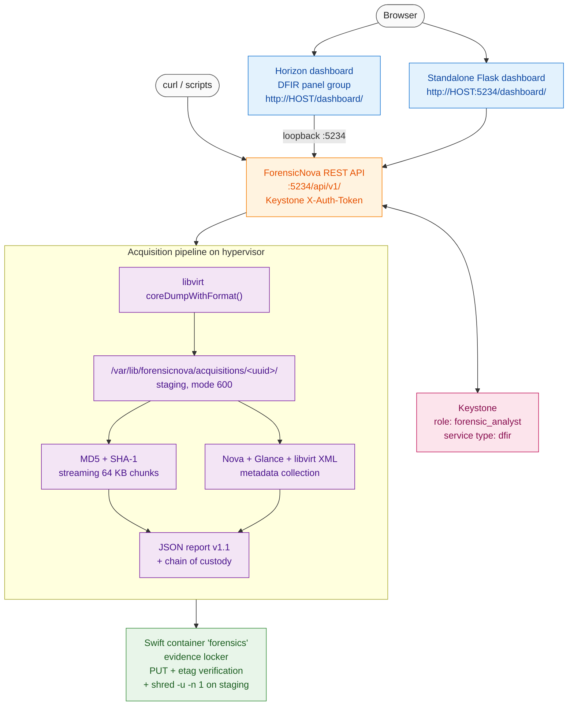
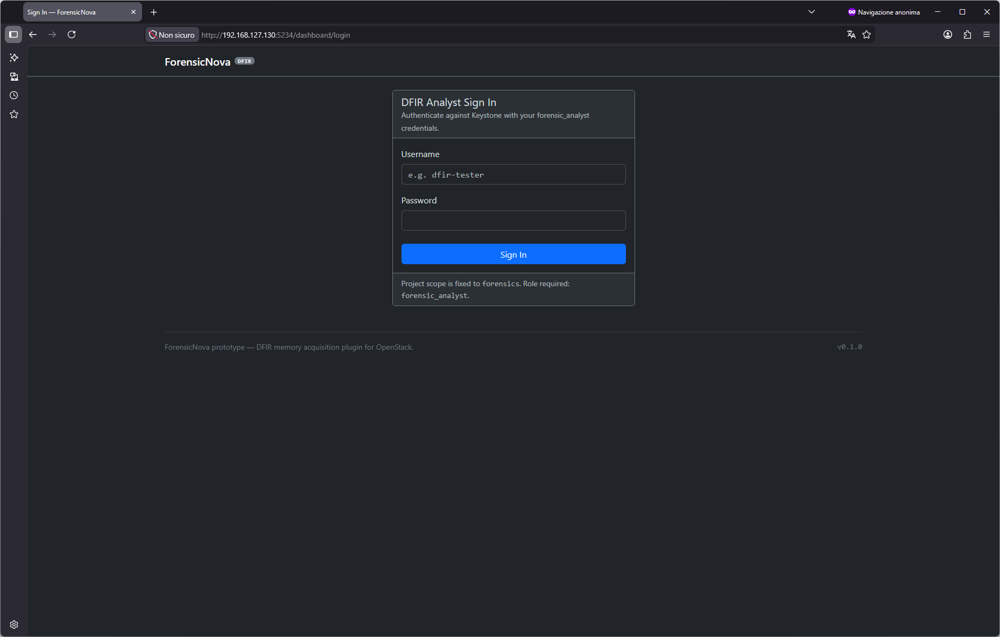
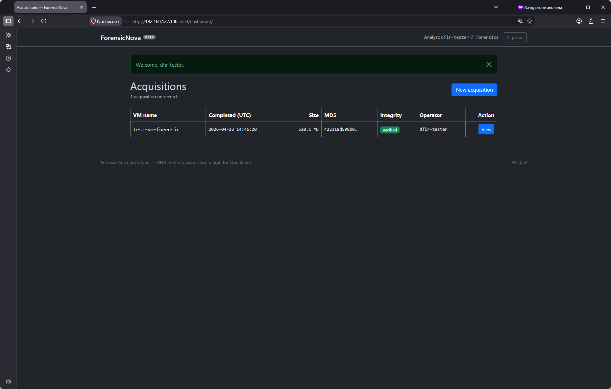
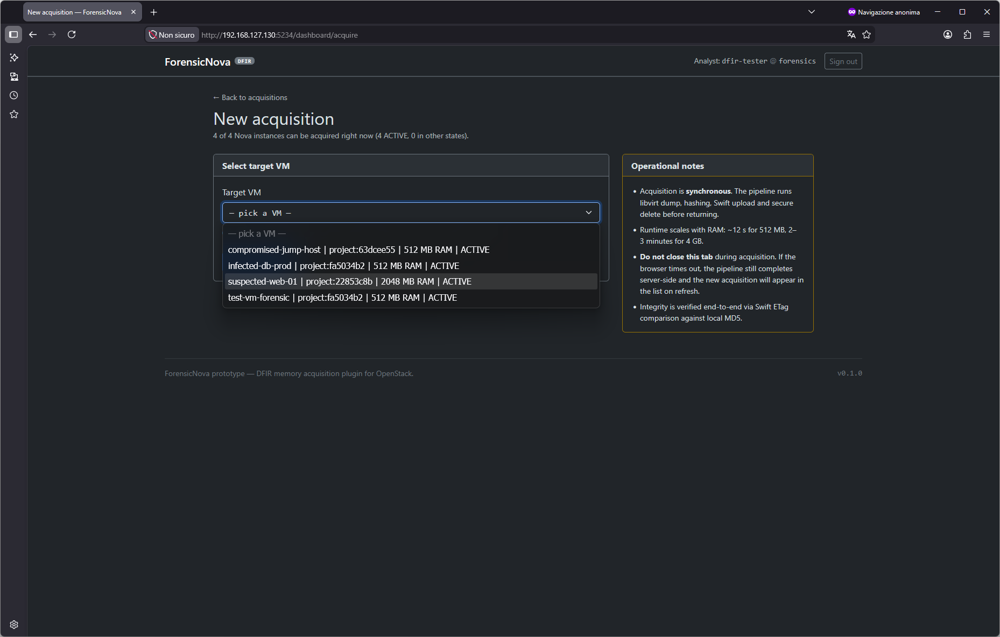
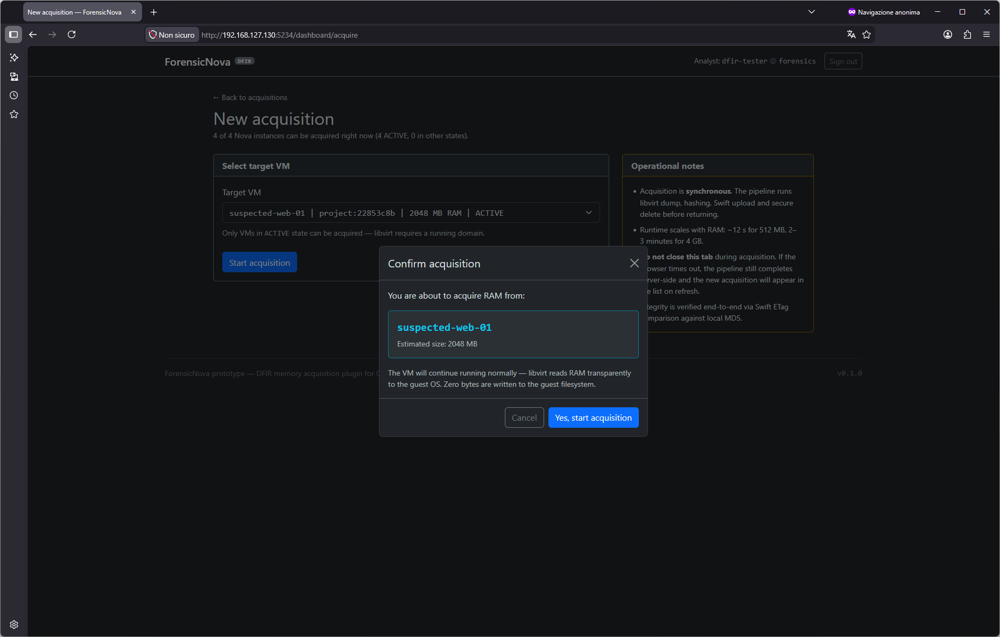
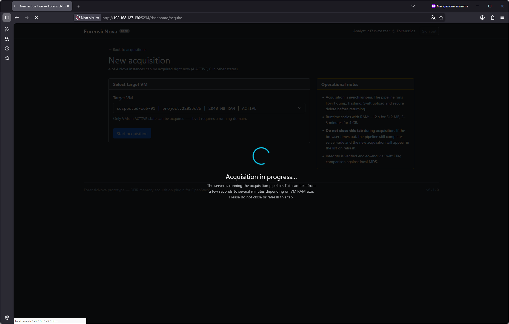
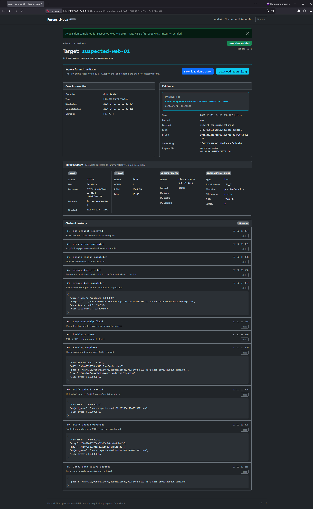
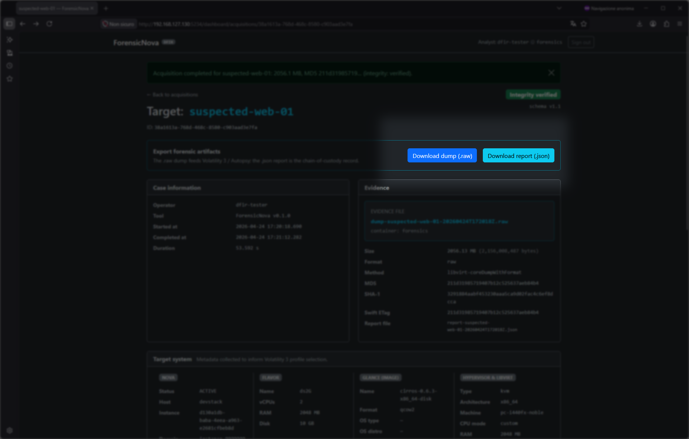
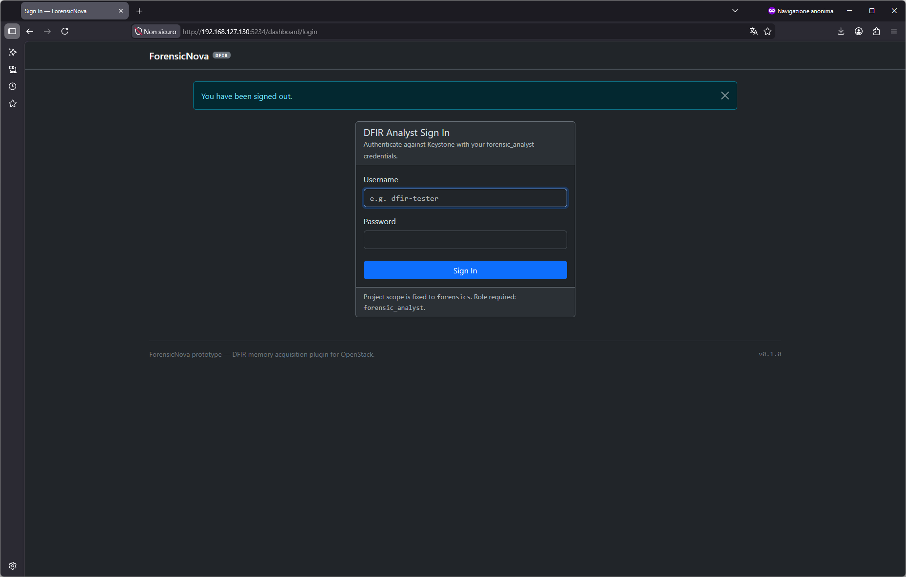

# ForensicNova

**DFIR memory acquisition plugin for OpenStack — forensically sound RAM dumps, cryptographic chain of custody, Swift-backed evidence locker.**

ForensicNova is a DevStack plugin that extends OpenStack with a dedicated digital-forensics service for incident response on tenant virtual machines. It acquires guest RAM at the hypervisor layer, computes integrity hashes in streaming fashion, stores the evidence in Swift with end-to-end etag verification, securely wipes the staging copy, and maintains an append-only chain-of-custody log — exposed through a Flask REST API and through two complementary dashboards (a self-contained Flask UI co-located with the service, and a Horizon panel group integrated into the standard OpenStack web console), all gated by a dedicated Keystone role. Each acquisition is persisted both as a machine-readable JSON report and as an on-demand printable PDF designed for operator countersignature and legal hand-off.

---

## Table of contents

- [Forensic soundness](#forensic-soundness)
- [Architecture](#architecture)
- [Quick start](#quick-start)
- [Horizon dashboard](#horizon-dashboard)
- [Standalone Flask dashboard](#standalone-flask-dashboard)
- [REST API](#rest-api)
- [Forensic reports](#forensic-reports)
- [Forensic evidence on disk](#forensic-evidence-on-disk)
- [Known limitations](#known-limitations)
- [Thesis roadmap](#thesis-roadmap)
- [Academic context](#academic-context)
- [License and author](#license-and-author)

---

## Forensic soundness

The acquisition pipeline is designed so that the resulting RAM dump is defensible in a judicial context. Six guarantees are implemented and traceable in the chain-of-custody log:

| # | Guarantee | Implementation |
|---|---|---|
| 1 | **Zero bits written inside the guest** | Acquisition happens via libvirt `coreDumpWithFormat()` reading `/proc/<qemu-pid>/mem` on the hypervisor. The guest OS is never touched, paged, or signaled. |
| 2 | **Dedicated forensic staging directory** | Temporary dump lands in `/var/lib/forensicnova/acquisitions/<uuid>/` with mode 600, owner `stack:stack`. Never in `/tmp`, never on the guest filesystem. |
| 3 | **Hashes computed on the hypervisor, before any transfer** | MD5 + SHA-1 computed in streaming (64 KB chunks, O(1) RAM) directly from the staging file. |
| 4 | **End-to-end etag integrity check with Swift** | On `PUT`, Swift returns an MD5 computed server-side. The plugin compares it against the hypervisor-local MD5. Mismatch → aborted pipeline, chain-of-custody flags `etag_verified: false`. |
| 5 | **Secure delete of the staging copy** | After a successful etag verification, the local dump is destroyed via `shred -u -n 1`. No recoverable residue on the hypervisor disk. |
| 6 | **Append-only chain of custody** | All pipeline events are written to `/var/log/forensicnova/chain-of-custody.jsonl` as JSON lines. The file is the authoritative audit log, immutable by design. |

These guarantees address the forensic chain from the moment RAM is read off the guest, through transfer and persistence in Swift, to every operator interaction thereafter.

---

## Architecture


```mermaid
flowchart TB
    classDef ui      fill:#e3f2fd,stroke:#1976d2,color:#0d47a1
    classDef api     fill:#fff3e0,stroke:#f57c00,color:#e65100
    classDef pipe    fill:#f3e5f5,stroke:#7b1fa2,color:#4a148c
    classDef store   fill:#e8f5e9,stroke:#388e3c,color:#1b5e20
    classDef auth    fill:#fce4ec,stroke:#c2185b,color:#880e4f
    classDef client  fill:#fafafa,stroke:#616161,color:#212121

    BROWSER([Browser]):::client
    CURL([curl / scripts]):::client

    HORIZON["Horizon dashboard<br/>DFIR panel group<br/>http://HOST/dashboard/"]:::ui
    FLASK_DASH["Standalone Flask dashboard<br/>http://HOST:5234/dashboard/"]:::ui

    REST["ForensicNova REST API<br/>:5234/api/v1/<br/>Keystone X-Auth-Token"]:::api
    KS["Keystone<br/>role: forensic_analyst<br/>service type: dfir"]:::auth

    subgraph PIPELINE["Acquisition pipeline on hypervisor"]
        direction TB
        LIBVIRT["libvirt coreDumpWithFormat()"]:::pipe
        STAGE["/var/lib/forensicnova/acquisitions/&lt;uuid&gt;/<br/>staging, mode 600"]:::pipe
        HASH["MD5 + SHA-1<br/>streaming 64 KB chunks"]:::pipe
        META["Nova + Glance + libvirt XML<br/>metadata collection"]:::pipe
        REPORT["JSON report v1.1<br/>+ chain of custody"]:::pipe
        LIBVIRT --> STAGE
        STAGE --> HASH
        STAGE --> META
        HASH --> REPORT
        META --> REPORT
    end

    SWIFT["Swift container 'forensics'<br/>evidence locker<br/>PUT + etag verification<br/>+ shred -u -n 1 on staging"]:::store

    BROWSER --> HORIZON
    BROWSER --> FLASK_DASH
    CURL --> REST
    HORIZON -->|loopback :5234| REST
    FLASK_DASH --> REST
    REST <--> KS
    REST --> PIPELINE
    PIPELINE --> SWIFT
```

**Pipeline stages.** The acquisition is composed of six functional stages, plus a cross-cutting **chain of custody** that records each meaningful sub-event throughout the run. CoC events are persisted to `/var/log/forensicnova/chain-of-custody.jsonl` (append-only) and embedded in the final JSON report. The pipeline runs asynchronously: the REST endpoint returns `202 Accepted` with a `job_id` in milliseconds, and a background worker advances the job through the stages while clients poll `/api/v1/jobs/<id>` for live phase labels.

1. `acquire_memory` — libvirt `coreDumpWithFormat()` writes raw memory to the per-acquisition staging directory
2. `compute_hashes` — MD5 + SHA-1 computed in a single streaming pass (64 KB chunks, O(1) RAM)
3. `collect_metadata` — Nova + Glance + libvirt XML consolidated in the `target_system` block
4. `upload_dump` — Swift `PUT` (single object below 4 GiB, SLO with 4 GiB segments above), response ETag compared to the local MD5
5. `secure_delete` — `shred -u -n 1` on the staging file (only if ETag verified)
6. `upload_report` — JSON report (schema v1.1) published to Swift next to the dump

The PDF forensic report is **not** part of the asynchronous pipeline: it is rendered on demand from the persisted JSON report through a dedicated REST endpoint, see [Forensic reports](#forensic-reports).

---

## Quick start

### Prerequisites

- Ubuntu 24.04 LTS host with hardware virtualization (KVM)
- DevStack `master` branch, tested against `2026.2`
- Python 3.12
- `stack` user with NOPASSWD sudo, membership in `libvirt` and `kvm` groups

### `local.conf` snippet

The minimal lines needed to enable ForensicNova on top of an existing DevStack `local.conf`. For a fully-commented working example see [`local.conf.example`](local.conf.example) at the root of this repository.

```ini
[[local|localrc]]
ADMIN_PASSWORD=secret
DATABASE_PASSWORD=$ADMIN_PASSWORD
RABBIT_PASSWORD=$ADMIN_PASSWORD
SERVICE_PASSWORD=$ADMIN_PASSWORD

HOST_IP=<your-host-ip>
SERVICE_HOST=$HOST_IP
MYSQL_HOST=$SERVICE_HOST
RABBIT_HOST=$SERVICE_HOST
GLANCE_HOSTPORT=$SERVICE_HOST:9292

# Cinder off, Swift on (forensic artifacts live in object storage)
disable_service cinder c-api c-sch c-vol
enable_service s-proxy s-object s-container s-account
SWIFT_HASH=change_me_to_a_random_string
SWIFT_REPLICAS=1
SWIFT_DATA_DIR=/opt/stack/data/swift

# Size the Swift loopback to accommodate forensic dumps + their SLO segments.
# The DevStack default (~6 GB) is too small for any acquisition above 4 GB
# of RAM. 30 GB gives room for several acquisitions of an 8 GiB guest.
SWIFT_LOOPBACK_DISK_SIZE=30G

LIBVIRT_TYPE=kvm

# ForensicNova plugin
FORENSICNOVA_DFIR_PASSWORD=<your-dfir-password>
enable_plugin forensicnova https://github.com/numdav/forensicnova main
```

Replace `<your-dfir-password>` with the password you want to assign to the `dfir-tester` user. Replace `<your-host-ip>` with the IP address of your DevStack host. Set `SWIFT_HASH` to any random string of your choice — it must be stable across reboots of the same deployment.

The single `enable_plugin forensicnova` line above transparently enables **two** DevStack services from the same monorepo: `forensicnova` (the Flask REST backend) and `forensicnova-dashboard` (the Horizon panel plugin). To deploy the backend only, add `disable_service forensicnova-dashboard` below the `enable_plugin` line.

### Stack and validate

```bash
cd /opt/stack/devstack
./stack.sh
```

Once the stack completes, verify the plugin is running:

```bash
# Systemd unit active
systemctl is-active devstack@forensicnova
# Expected: active

# Health endpoint reachable
curl http://<HOST_IP>:5234/health
# Expected: {"status":"ok","service":"forensicnova","version":"..."}

# Keystone service catalog entry
openstack service show dfir -f value -c type
# Expected: dfir
```

### Access the dashboards

ForensicNova ships with two operator UIs. They are functionally equivalent; the choice is between a self-contained UI co-located with the service and a UI integrated in the standard OpenStack web console.

**Horizon dashboard** (recommended for OpenStack-native operators). Open `http://<HOST_IP>/dashboard/` in a browser. After logging in as `dfir-tester`, expand the **DFIR** entry in the left sidebar to reach the **Forensics → Acquisitions** and **Forensics → New acquisition** panels.

**Standalone Flask dashboard**. Open `http://<HOST_IP>:5234/dashboard/` in a browser. Same `dfir-tester` credentials, project `forensics`. Functionally equivalent to the Horizon panels; useful as a fallback when the Horizon plugin is disabled.

Credentials in both cases:

- **Username**: `dfir-tester`
- **Password**: the one set via `FORENSICNOVA_DFIR_PASSWORD`
- **Project**: `forensics`

---

## Horizon dashboard

The Horizon dashboard plugin registers a new top-level **DFIR** dashboard in the OpenStack web console, with a **Forensics** panel group containing two panels. It is installed in editable mode (`pip install -e`) into Horizon's venv at plugin extra-phase, and registers its panels via `_9NNN_*.py` drop-ins under `/opt/stack/horizon/openstack_dashboard/local/enabled/`.

### Acquisitions panel

Lists every acquisition stored in the `forensics` Swift container, with one row per acquisition. Columns: start time, VM name, operator, dump size (humanized), upload method (`single_put` or `slo` with segment count) and integrity status. Per-row actions: download PDF, download JSON, download raw dump.

Clicking the VM name opens a detail page that renders the full JSON report v1.1 (timestamps, `target_system`, dump hashes, chain of custody, SLO segments).

### New acquisition panel

A form with a single dropdown listing all Nova instances visible to the analyst — cross-tenant, because `dfir-tester` carries the `admin` role on every project (see [Known limitations](#known-limitations)). Inactive (non-`ACTIVE`) instances are listed but disabled, because libvirt's `coreDumpWithFormat()` requires a running domain.

Submitting the form triggers the async pipeline on the backend and redirects to a **watch page** that polls `/api/v1/jobs/<id>` every 2 seconds, showing live status (`pending` / `running` / `completed` / `failed`), the current human-readable phase label (e.g. `"Uploading dump (segment 2 of 3)"` for SLO acquisitions) and elapsed seconds. On completion the browser is redirected to the acquisition detail page; on failure, the error message from the backend is displayed inline.

### Authentication flow

The Horizon plugin forwards the operator's Keystone token in `X-Auth-Token` to the ForensicNova REST API. Keystone enforces the `forensic_analyst` role, which Horizon's permission middleware also checks at the URL-routing layer (URLs are unreachable without the role). The polling JavaScript goes through a server-side proxy view, so that the browser session cookie is sufficient on the JS side — the Keystone token never leaves the server.

### Service discovery via Keystone catalog

The ForensicNova service registers itself in the Keystone catalog (service type `dfir`) at plugin extra-phase. The Horizon plugin's client resolves the REST endpoint by catalog lookup, falling back to the `FORENSICNOVA_URL` environment variable. No host:port is hardcoded in the dashboard codebase — the URL pattern of every page is also built via Django `reverse()`, including the post-completion redirect target on the watch page.

---

## Standalone Flask dashboard

The standalone Flask dashboard is the in-service operator UI, co-located with the REST backend on port `5234`. It is a session-authenticated Flask blueprint, available as an alternative to the Horizon panels for environments where the Horizon plugin is not deployed. It requires a Keystone user holding the `forensic_analyst` role.

### 1. Login



Credentials are validated against Keystone directly (OAuth-style token request). A successful login requires the `forensic_analyst` role on the target project; otherwise the login is rejected with a clear error message.

### 2. Acquisitions list



The landing page after login. Each row shows the VM name, acquisition timestamp, dump size, MD5 prefix, and quick links to the detail view. The list is populated by scanning the `forensics` Swift container and parsing the JSON reports.

### 3. New acquisition form



The "Acquire" action opens a form with a dropdown of all VMs visible to the `dfir-tester` user — across every Keystone project. This cross-tenant visibility is the practical embodiment of the `forensic_analyst` role: an incident responder does not pre-know which project holds the compromised VM.

### 4. Confirmation modal



Acquiring RAM is a privileged, long-running operation. A Bootstrap modal asks for explicit confirmation before the pipeline starts. The selected VM's name is echoed in the modal to prevent misclicks.

### 5. Acquisition in progress



During the acquisition, the UI shows a spinner overlay. For a 2 GB guest, the full pipeline (libvirt dump, hashing, Swift upload with etag verify, secure delete, report publish) completes in roughly 5 to 10 seconds on a KVM-nested lab setup.

### 6. Acquisition detail



The detail view renders the full JSON report in a human-readable layout: timestamps, instance metadata, `target_system` (which helps Volatility 3 auto-select the correct profile), dump metadata including both hashes and the verified Swift etag, and the chain-of-custody timeline with all pipeline events in order.

### 7. Download actions



From the detail page the operator can download the raw dump (`.raw`), the JSON report (`.json`), and the printable PDF forensic report (see [Forensic reports](#forensic-reports)) directly. Downloads are streamed from Swift through the API with constant memory usage on the ForensicNova service, so multi-gigabyte dumps do not blow up the WSGI process.

### 8. Logout



Session teardown removes the cached Keystone token and shows a confirmation flash on the login page. The session cookie is also invalidated server-side.

---

## REST API

All endpoints listen on port `5234`. Every route under `/api/v1/` is authenticated via Keystone token (`X-Auth-Token` header) and requires the `forensic_analyst` role on the scoped project.

| Method | Path | Auth | Description |
|---|---|---|---|
| `GET` | `/health` | none | Service liveness probe. |
| `POST` | `/api/v1/servers/<id>/memory_acquire` | token | Asynchronously triggers RAM acquisition on the Nova instance `<id>`. Returns `202 Accepted` with a `job_id` in milliseconds; the pipeline runs in a background worker. |
| `GET` | `/api/v1/servers/` | token | Lists all Nova instances visible to the authenticated user (cross-tenant for `forensic_analyst`). |
| `GET` | `/api/v1/jobs/` | token | Lists all acquisition jobs (running and recently completed), most recent first. |
| `GET` | `/api/v1/jobs/<job_id>` | token | Returns the current job record (`status`, `phase`, `label`, `elapsed_seconds`, `result` once complete). Designed for 2-second polling. |
| `GET` | `/api/v1/acquisitions/` | token | Lists all acquisitions in the Swift evidence container with summary metadata. |
| `GET` | `/api/v1/acquisitions/<id>` | token | Returns the full JSON report for acquisition `<id>`. |
| `GET` | `/api/v1/acquisitions/<id>/dump` | token | Streams the raw dump file (`.raw`) as an HTTP attachment. |
| `GET` | `/api/v1/acquisitions/<id>/report` | token | Returns the JSON report as a downloadable attachment. |
| `GET` | `/api/v1/acquisitions/<id>/report.pdf` | token | On-demand renders and returns the printable PDF forensic report (ReportLab). Each invocation produces a new PDF with its own generation timestamp and `CreationDate`; the underlying JSON remains the canonical source of truth. See [Forensic reports](#forensic-reports) for the section-by-section layout. |

### Example: trigger an acquisition and watch progress

```bash
# Obtain a Keystone token scoped to the forensics project
TOKEN=$(openstack token issue -f value -c id)

# Async trigger — returns 202 with a job_id
JOB_ID=$(curl -sX POST \
     -H "X-Auth-Token: $TOKEN" \
     http://<HOST_IP>:5234/api/v1/servers/<instance-uuid>/memory_acquire \
     | jq -r .job_id)

# Poll until complete
while true; do
    JOB=$(curl -s -H "X-Auth-Token: $TOKEN" \
         http://<HOST_IP>:5234/api/v1/jobs/$JOB_ID)
    STATUS=$(echo "$JOB" | jq -r .status)
    LABEL=$(echo "$JOB" | jq -r .label)
    echo "[$STATUS] $LABEL"
    [[ "$STATUS" == "completed" || "$STATUS" == "failed" ]] && break
    sleep 2
done

# Fetch the final report
ACQ_ID=$(echo "$JOB" | jq -r .result.acquisition_id)
curl -s -H "X-Auth-Token: $TOKEN" \
     http://<HOST_IP>:5234/api/v1/acquisitions/$ACQ_ID | jq .dump
```

### JSON report schema (v1.1)

The report below mirrors the actual output produced by `app/reports/json_report.py`. UTC timestamps are emitted with microsecond precision (`.%f`); fields that the underlying OpenStack APIs do not advertise (e.g. `os_distro` for CirrOS images) are reported as `null`.

```jsonc
{
  "schema_version": "1.1",
  "acquisition_id": "<uuid4>",
  "operator":       "dfir-tester",
  "tool": {
    "name":    "ForensicNova",
    "version": "0.1.0"
  },
  "timestamps": {
    "started_at":       "2026-04-24T18:25:49.000000Z",
    "completed_at":     "2026-04-24T18:25:57.120000Z",
    "duration_seconds": 8.12
  },
  "instance": {
    "id":     "<nova-instance-uuid>",
    "name":   "<vm-name>",
    "domain": "instance-00000042"
  },
  "target_system": {
    "nova": {
      "id":     "<nova-instance-uuid>",
      "name":   "<vm-name>",
      "status": "ACTIVE",
      "created": "2026-04-20T10:00:00Z",
      "host":   "<compute-host>",
      "hypervisor_hostname": "<compute-host>"
    },
    "flavor": {
      "id":      "<flavor-id>",
      "name":    "ds2G",
      "ram_mb":  2048,
      "vcpus":   1,
      "disk_gb": 20
    },
    "glance": {
      "id":             "<image-id>",
      "name":           "cirros-0.6.3-x86_64-disk",
      "disk_format":    "qcow2",
      "container_format": "bare",
      "os_type":        null,
      "os_distro":      null,
      "os_version":     null,
      "architecture":   null,
      "hw_machine_type": null
    },
    "hypervisor": { "type": "kvm" },
    "libvirt": {
      "domain_name":  "instance-00000042",
      "architecture": "x86_64",
      "machine_type": "pc-q35-9.0",
      "memory_kib":   2097152,
      "memory_mb":    2048,
      "vcpus":        1,
      "cpu_mode":     "host-model"
    }
  },
  "dump": {
    "size_bytes":         2147483648,
    "md5":                "<hex>",
    "sha1":               "<hex>",
    "swift_object":       "forensics/dump-<sanitized_vm_name>-<UTC>.raw",
    "swift_etag":         "<hex>",
    "etag_verified":      true,
    "format":             "raw",
    "acquisition_method": "libvirt-coreDumpWithFormat"
  },
  "report": {
    "swift_object": "forensics/report-<sanitized_vm_name>-<UTC>.json",
    "filename":     "report-<sanitized_vm_name>-<UTC>.json"
  },
  "chain_of_custody": {
    "total_events": 11,
    "events": [
      {
        "seq":         1,
        "event_type":  "api_request_received",
        "description": "REST endpoint received the acquisition request",
        "timestamp":   "2026-04-24T18:25:49.123456Z",
        "data": {
          "instance_id":    "<nova-instance-uuid>",
          "endpoint":       "memory_acquire",
          "client_address": "192.0.2.10"
        }
      },
      {
        "seq":         5,
        "event_type":  "hashing_completed",
        "description": "Hashes computed (single-pass, 64 KB chunks)",
        "timestamp":   "2026-04-24T18:25:53.456789Z",
        "data": {
          "size_bytes":       2147483648,
          "md5":              "<hex>",
          "sha1":             "<hex>",
          "duration_seconds": 3.45
        }
      },
      {
        "seq":         8,
        "event_type":  "swift_upload_verified",
        "description": "Swift ETag matches local MD5 — integrity confirmed",
        "timestamp":   "2026-04-24T18:25:55.789012Z",
        "data": {
          "object_name": "dump-<sanitized_vm_name>-<UTC>.raw",
          "container":   "forensics",
          "etag":        "<hex>",
          "md5":         "<hex>",
          "size_bytes":  2147483648
        }
      }
      // ... events 2–4, 6–7, 9–11 elided for brevity
    ]
  }
}
```

---

## Forensic reports

Each acquisition produces two complementary deliverables, plus an optional printable PDF generated on demand. The three artifacts are designed for different audiences and serve different roles in the forensic workflow.

### JSON report — canonical source of truth

The JSON report (schema v1.1) is the **canonical record** of the acquisition: it is generated as the final stage of the acquisition pipeline and uploaded to Swift next to the raw dump. It contains immutable forensic data — both hashes (MD5 + SHA-1), the Swift ETag verification result, the consolidated `target_system` block (Nova + Glance + libvirt XML), and the complete chain of custody as a sequence of timestamped events. It is intended for machine consumption: downstream analysis tools, archival systems, hash-validation pipelines, future Volatility / YARA integrations.

Endpoints: `GET /api/v1/acquisitions/<id>` (in-memory dict) and `GET /api/v1/acquisitions/<id>/report` (downloadable file). Full schema documented in [REST API](#rest-api).

### PDF forensic report — printable, signable, on-demand

The PDF is a forensic-grade printable deliverable, rendered on demand from the canonical JSON via the ReportLab library (`app/reports/pdf_report.py`). It is **not** part of the asynchronous acquisition pipeline; it is generated when an operator requests `GET /api/v1/acquisitions/<id>/report.pdf` (or clicks the corresponding action in either dashboard).

The PDF is laid out as a sequence of sections, each produced by a dedicated `render_*` function returning ReportLab Flowables — reusable as-is by a future cumulative case-level report (thesis roadmap item) without modification:

- **Cover page** — three stacked blocks. *Acquisition identity*: a key-value table covering the acquisition UUID, operator (Keystone username), target VM (name, UUID, libvirt domain), acquisition timeline (started, completed, duration), MD5, SHA-1, integrity-verification outcome, tool name+version and report schema. *Document generation*: PDF build timestamp (UTC), generator identity, document type. *Operator signature block*: physical signature lines for a printed countersignature — a line for the full name in block capitals (with a hint underneath, `authenticated as Keystone user: <op>`, binding the handwritten name to the immutable Keystone session identity in the JSON), a line for date and place, and a line for the actual ink signature.
- **Evidence** — key-value table with Swift object name, container, dump size (humanized + bytes), format, acquisition method, MD5, SHA-1, Swift ETag, ETag-verified outcome, and upload method. If the dump was uploaded as a Swift Static Large Object, an additional sub-table lists every segment (index, name, size, MD5, ETag).
- **Target system** — four sub-blocks rendered as separate key-value tables: Nova (id, name, status, created, compute host, hypervisor host), Flavor (id, name, vCPUs, RAM, disk), Glance image (id, name, disk/container format, OS type/distro/version, architecture, hw_machine_type), and Hypervisor & libvirt (type, domain name, architecture, machine type, CPU mode, memory, vCPUs).
- **Chain of custody** — numbered timeline table (seq, timestamp, event type, description) followed by a section dumping each event's `data` payload as pretty-printed JSON in monospace. Failure events (`*_failed`, `integrity_failure`) are highlighted in red so they stand out at first glance.
- **Analysis** — placeholder section reserved for future Volatility 3 / YARA / threat-intelligence output. In the current prototype it renders an amber-banner notice "Analysis: not yet performed" plus an empty key-value scaffold (analysis started/completed timestamps, analyst, tools/versions), so the structural layout of the PDF stays consistent once the thesis populates it.
- **Notice** — final page, separated by an explicit page break. Four paragraphs of legal disclaimer covering the role of the PDF relative to the JSON+RAW canonical evidence, the cryptographic integrity guarantees, the "distinct print event" property of each generation, and the academic-prototype status of the project.

**Headers and footers on every page.** Top band: `ForensicNova — volatile memory acquisition report` on the left, operator identity on the right. Bottom band: full acquisition UUID on the left and `page X of Y` on the right. The "X of Y" pagination relies on a two-pass `NumberedCanvas` build (every page is committed only after the total page count is known), so any printed copy can be inspected for completeness at a glance — relevant when the document is physically handed off in a legal context.

**Each print is a distinct document.** Every PDF generated from the same JSON has its own `CreationDate` (set by ReportLab at build time) and is byte-different from previous prints. This is intentional, not a defect — every print event is independently traceable. The JSON, by contrast, is fixed at acquisition time and never changes. The PDF is an *act of printing*; the JSON is the evidence. The Notice page makes this property explicit in plain language for non-technical readers.

### Raw dump

The raw memory dump (`dump-<sanitized_vm_name>-<UTC>.raw`) is the primary forensic evidence. It is streamed from Swift on `GET /api/v1/acquisitions/<id>/dump` with constant memory usage on the ForensicNova service, so multi-gigabyte transfers do not blow up the WSGI process. Authoritative integrity is provided by the MD5 + SHA-1 stored in the JSON report.

---

## Forensic evidence on disk

The plugin writes to well-defined locations on the hypervisor and on Swift. These paths are stable and documented so an incident responder can locate evidence even without the dashboard.

| Location | Contents | Purpose |
|---|---|---|
| `/var/lib/forensicnova/acquisitions/<uuid>/` | Temporary raw dump (mode 600, owner `stack:stack`) | Hypervisor-local staging, deleted after successful Swift upload via `shred`. |
| `/var/lib/forensicnova/jobs/` | One JSON file per acquisition job (`<job_id>.json`) | Filesystem-persisted `JobManager` state. Survives service restarts so a polling client can keep watching across a Flask reload. |
| `/var/lib/forensicnova/secret_key` | Flask session secret (mode 600) | Cookie signing for the dashboard session. |
| `/var/log/forensicnova/chain-of-custody.jsonl` | Append-only JSON-lines audit log | Authoritative record of every pipeline event, used to reconstruct history. |
| `/var/log/forensicnova/forensicnova.log` | Python logging output | Operational log of the Flask service. |
| `/etc/forensicnova/forensicnova.conf` | INI configuration file | Keystone endpoint, Swift container name, DFIR project/user. |
| Swift container `forensics` | `dump-*.raw` + `report-*.json` (+ PDF on demand) pairs | Persistent evidence locker, survives service restarts. |
| Swift container `forensics_segments` | SLO segments `<dump_object>/seg-NNNN` | Holds the 4 GiB segments of large dumps uploaded via Swift Static Large Object. |

### Listing Swift evidence from the command line

```bash
openstack \
  --os-auth-url http://<HOST_IP>/identity \
  --os-identity-api-version 3 \
  --os-username dfir-tester \
  --os-password <your-dfir-password> \
  --os-project-name forensics \
  --os-user-domain-name Default \
  --os-project-domain-name Default \
  object list forensics
```

### Chain of custody: sample line

A real line from `/var/log/forensicnova/chain-of-custody.jsonl`. The format is one self-contained JSON object per line, with the schema enforced by `app/reports/chain_of_custody.py`. Fields: `acquisition_id`, `operator`, `event_type` (snake_case), `timestamp` (ISO-8601 UTC with microseconds, `Z` suffix), and a free-form `data` object whose shape depends on the event.

```jsonl
{"acquisition_id":"a3f2c1d0-1234-5678-9abc-def012345678","operator":"dfir-tester","event_type":"swift_upload_verified","timestamp":"2026-04-24T18:25:55.789012Z","data":{"object_name":"dump-suspected-web-01-20260424T182549Z.raw","container":"forensics","etag":"ab12cd34ef56...","md5":"ab12cd34ef56...","size_bytes":2147483648}}
```

The `seq`, `description` and per-event human-readable context are added by `json_report.py` only when the events are folded into the final report; the on-disk JSONL is the raw event stream and is intentionally minimal.

---

## Known limitations

The prototype intentionally accepts a small number of documented limitations that do not affect the forensic soundness of individual acquisitions.

### DevStack-only: Swift data lost after `unstack → stack`

Swift uses the Keystone project UUID as its storage namespace (`AUTH_<project_id>`). In DevStack, `./unstack.sh` followed by `./stack.sh` destroys and recreates Keystone projects with fresh UUIDs, making previously stored Swift objects orphan in namespaces that no longer exist. The underlying `swift.img` filesystem is preserved, but the data is unreachable through the Swift API.

This is DevStack-specific behaviour — DevStack is an ephemeral test environment by design. **In a production OpenStack deployment, project UUIDs are stable for the lifetime of the cloud and Swift objects persist indefinitely**. Regular reboots of the host VM do not cause data loss; only the explicit `unstack → stack` sequence does.

### Cross-tenant forensic analyst privileges

To query Nova and Glance metadata for VMs owned by any tenant, `dfir-tester` is granted the `admin` role on every Keystone project by the plugin. This is a pragmatic choice for the prototype, matching the operational reality of an incident responder who does not pre-know which tenant owns a compromised VM. Production deployments may want to tighten this grant.

### fstab discipline after unstack

DevStack occasionally leaves or duplicates `swift.img` loop-mount entries in `/etc/fstab` after an interrupted `./stack.sh` or a plain `./unstack.sh`. A subsequent reboot with duplicates triggers emergency mode. The operator is expected to verify `grep -c swift.img /etc/fstab` equals `0` before reboot and `1` after a successful stack. The ForensicNova plugin does not touch `/etc/fstab` — this is a DevStack known issue outside the plugin's scope.

### Large acquisitions and the Swift loopback

The dump uploader in `app/storage/swift_client.py` branches on file size: dumps below 4 GiB are uploaded with a single Swift `PUT` and verified end-to-end against the server-returned ETag; dumps at or above 4 GiB are uploaded as a Swift Static Large Object (SLO), split into 4 GiB segments stored in a companion `<container>_segments` container with a JSON manifest stored alongside the dump in the main container. A composite ETag (`md5(concat seg_etags)-N`) is verified end-to-end and orphan segments are cleaned up on any failure. There is no hard cap on guest RAM size.

In DevStack, the Swift backend is a loopback file (`/opt/stack/data/swift/drives/images/swift.img`) whose size defaults to roughly 6 GB. This is too small to hold even a single 8 GiB SLO acquisition. The provided `local.conf.example` sets `SWIFT_LOOPBACK_DISK_SIZE=30G` to accommodate multi-acquisition workflows and leave headroom for Swift internals. Raise the value further if you intend to keep many large acquisitions in the evidence locker without re-stacking.

### Nova/libvirt state desync after host boot

After a reboot of the hypervisor, Nova reports guests as `SHUTOFF` by default (`resume_guests_state_on_host_boot=False`). This is intended DevStack behaviour, not a bug. Guests must be explicitly started via `openstack server start <name>` before an acquisition can succeed.

---

## Thesis roadmap

The prototype is the baseline for the M.Sc. thesis. Planned incremental work, building on top of the current code without breaking changes:

- **Volatility 3 IOC extraction** — on-demand analysis of Windows RAM dumps stored in Swift: hidden processes, active network connections, injected DLLs, LSASS credential material. Findings attached to the JSON report as a new `analysis.volatility` section, which the PDF Analysis block will then render in place of the current "not yet performed" placeholder.
- **YARA scanning** — signature-based triage of RAM dumps against known malware families and custom threat-actor rules, feeding into the same `analysis` section of the report.
- **Threat intelligence correlation** — IOC lookup against MISP / STIX-TAXII feeds to tag hashes, IPs, domains with campaign attribution.
- **Unified incident timeline** — cross-correlation between RAM findings and OpenStack service logs (Nova, Keystone, Neutron) to reconstruct attack sequences against a compromised VM.
- **PDF report layout overhaul** — replace the JSON blocks currently embedded in the PDF chain-of-custody section with structured tables of the forensically relevant fields. The raw JSON stays available as a separate downloadable artifact.
- **Cumulative signed PDF report** — on-demand generation of a PDF bundling multiple acquisitions, with a deterministic cover sheet for legal hand-off. Reuses the same `render_*` building blocks that produce the per-acquisition PDF today.

---

## Academic context

Developed as exam project for *Piattaforme di Cloud Computing* and as baseline for an M.Sc. thesis — Università degli Studi di Salerno, ISISLab.

---

## License and author

License: to be defined, likely Apache-2.0 for consistency with the OpenStack ecosystem.

**Author**: Davide (GitHub [@numdav](https://github.com/numdav))
